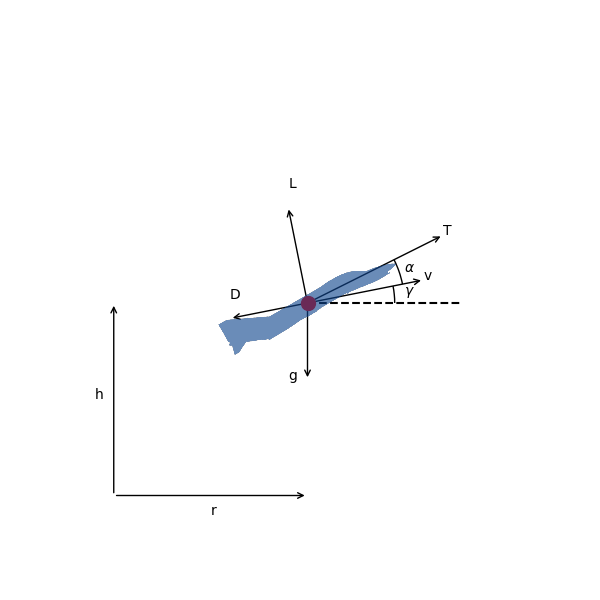

# Supersonic Interceptor Minimum Time Climb

This example is based on the _A/C Min Time to Climb_ example given in
chapter 4 of Bryson[@bryson1999dynamic]. It finds the
angle-of-attack history required to accelerate a supersonic interceptor
from near ground level, Mach 0.4 to an altitude of 20 km and Mach 1.0.

The vehicle dynamics are given by

\begin{align}
  \frac{dv}{dt} &= \frac{T}{m} \cos \alpha - \frac{D}{m} - g \sin \gamma \\
  \frac{d\gamma}{dt} &= \frac{T}{m v} \sin \alpha + \frac{L}{m v} - \frac{g \cos \gamma}{v} \\
  \frac{dh}{dt} &= v \sin \gamma \\
  \frac{dr}{dt} &= v \cos \gamma \\
  \frac{dm}{dt} &= - \frac{T}{g I_{sp}}
\end{align}

The initial conditions are

\begin{align}
  r_0 &= 0 \rm{\,m} \\
  h_0 &= 100 \rm{\,m} \\
  v_0 &= 135.964 \rm{\,m/s} \\
  \gamma_0 &= 0 \rm{\,deg} \\
  m_0 &= 19030.468 \rm{\,kg}
\end{align}

and the final conditions are

\begin{align}
  h_f &= 20000 \rm{\,m} \\
  M_f &= 1.0 \\
  \gamma_0 &= 0 \rm{\,deg}
\end{align}

## The ODE System: min_time_climb_ode.py

The top level ODE definition is a _Group_ that connects several subsystems.

=== "min_time_climb.min_time_climb_ode.py"
{{ inline_source('dymos.examples.min_time_climb.min_time_climb_ode',
include_def=True,
include_docstring=True,
indent_level=0)
}}

## Building and running the problem

In the following code we follow the following process to solve the
problem:

{{ embed_test('dymos.examples.min_time_climb.doc.test_doc_min_time_climb.TestMinTimeClimbForDocs.test_min_time_climb_for_docs_gauss_lobatto') }}

## References

\bibliography
