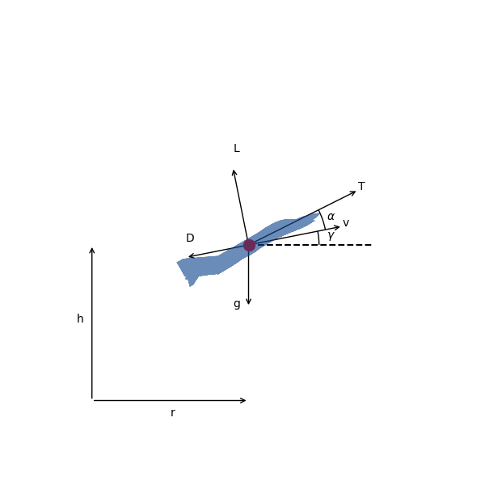

=========================================
Supersonic Interceptor Minimum Time Climb
=========================================

This example is based on the "A/C Min Time to Climb" example given in chapter 4 of [BrysonDynOpt]_.
It finds the angle-of-attack history required to accelerate a supersonic interceptor from near
ground level, Mach 0.4 to an altitude of 20 km and Mach 1.0.

The vehicle dynamics are given by

.. math ::
    \frac{d v}{d t} &= \frac{T}{m} \cos(\alpha) - \frac{D}{m} - g \sin(\gamma) \\
    \frac{d \gamma}{d t} &= \frac{T}{mv} \sin(\alpha) + \frac{L}{mv} - \frac{g \cos(\gamma)}{v} \\
    \frac{d h}{d t} &= v \sin(\gamma) \\
    \frac{d r}{d t} &= v \cos(\gamma) \\
    \frac{d m}{d t} &= -\frac{T}{g I_{sp}}

The initial conditions are

.. math ::
    r_0 &= 0 \, \mathrm{m} \\
    h_0 &= 100 \, \mathrm{m} \\
    v_0 &= 135.964 \, \mathrm{m/s} \\
    \gamma_0 &= 0 \, \mathrm{deg} \\
    m_0 &= 19030.468 \, \mathrm{kg}

and the final conditions are

.. math ::
    h_f &= 20000 \, \mathrm{m} \\
    M_f &= 1.0 \\
    \gamma_0 &= 0 \, \mathrm{deg}

1. The ODE System: min_time_climb_ode.py
----------------------------------------

..  embed-code::
    dymos.examples.min_time_climb.min_time_climb_ode
    :layout: code

2. Building and running the problem
-----------------------------------

In the following code we follow the following process to solve the problem:

.. embed-code::
    dymos.examples.min_time_climb.doc.test_doc_min_time_climb.TestMinTimeClimbForDocs.test_min_time_climb_for_docs_gauss_lobatto
    :layout: code, output, plot

References
----------
.. [BrysonDynOpt] Bryson, Arthur Earl. Dynamic optimization. Vol. 1. Prentice Hall, p.172, 1999.
