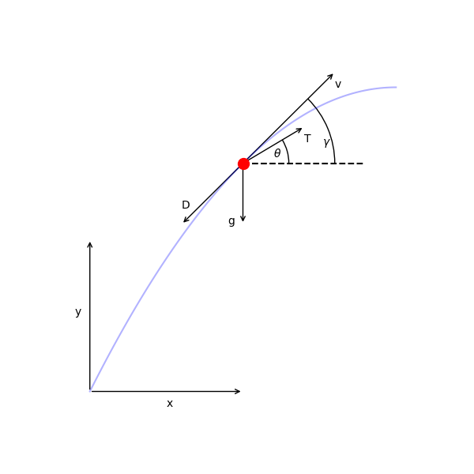

=================
SSTO Earth Launch
=================

This example is based on the "Time-Optimal Launch of a Titan II" example given in Appendix B of
[Longuski2016]_.  It finds the pitch profile for a single-stage-to-orbit launch vehicle that minimizes
the time required to reach orbit insertion under constant thrust.

The vehicle dynamics are given by

.. math ::
    \frac{d x}{d t} &= v_x \\
    \frac{d y}{d t} &= v_y \\
    \frac{d v_x}{d t} &= \frac{1}{m} \left( T \cos(\theta) - D \cos(\gamma) \right) \\
    \frac{d v_y}{d t} &= \frac{1}{m} \left( T \sin(\theta) - D \sin(\gamma) \right) - g \\
    \frac{d m}{d t} &= \frac{T}{g I_{sp}}

The initial conditions are

.. math ::
    x_0 &= 0 \\
    y_0 &= 0 \\
    v_{x0} &= 0 \\
    v_{y0} &= 0 \\
    m_0 &= 117000 \mathrm{kg}

and the final conditions are

.. math ::
    x_f &= \mathrm{free} \\
    y_f &= 185 \mathrm{km} \\
    v_{xf} &= V_{circ} \\
    v_{yf} &= 0 \\
    m_f &= \mathrm{free}

--------------------------------
Component and Group Definitions
--------------------------------

The ODE system for this problem consists of two components. The atmosphere component computes density (:math:`\rho`).
The eom component computes the state rates.

.. figure:: figures/ssto_xdsm.png

    The XDSM diagram for the ODE system in the SSTO problem.  The unconnected inputs to the EOM
    at the top of the diagram are provided by the Dymos phase as states, controls, or time values.
    The outputs, including the state rates, are shown on the right side of the diagram.  The Dymos
    phases use state rate values to ensure that the integration technique satisfies the dynamics
    of the system.

launch_vehicle_2d_eom_comp.py
------------------------------
.. embed-code::
    dymos.examples.ssto.launch_vehicle_2d_eom_comp
    :layout: code

log_atmosphere_comp.py
------------------------
.. embed-code::
    dymos.examples.ssto.log_atmosphere_comp
    :layout: code

launch_vehicle_ode.py
----------------------
.. embed-code::
    dymos.examples.ssto.launch_vehicle_ode
    :layout: code

-------------------
Solving the problem
-------------------
.. embed-code::
    dymos.examples.ssto.doc.test_doc_ssto_earth.TestDocSSTOEarth.test_doc_ssto_earth
    :layout: code, plot

References
----------
.. [Longuski2016] Longuski, James M., José J. Guzmán, and John E. Prussing. Optimal control with aerospace applications. Springer, 2016.

