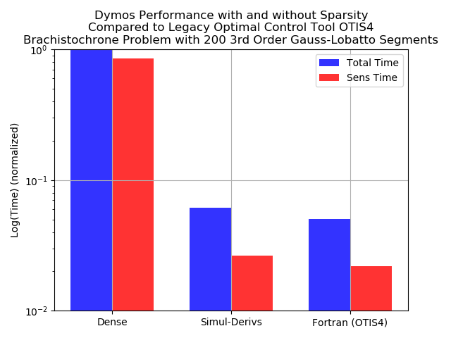

=============================================
Brachistochrone with Simultaneous Derivatives
=============================================

A key feature of collocation algorithms such as high-order Gauss-Lobatto collocation or the
Radau pseudospectral method is that they exhibit a large degree of *sparsity* in the total
Jacobian.  By modeling the state-time histories as a series of polynomial segments, the collocation
defect constraints within each segment are largely dependent only on the state and control values
within the same segment.  State-of-the-art pseudospectral optimization tools such as SOCS, OTIS,
and GPOPS-II use the notion of *sparse finite differences* to perturb multiple independent variables
simultaneously when approximating the constraint Jacobian.  This can significantly reduce the
computational effort required to approximate the entire Jacobian via finite difference.

The unique way in which OpenMDAO assembles analytic derivatives across the problem allows us to
use a similar approach to provide the analytic constraint Jacobian.  This approach can reduce the time
required to solve moderately-sized optimal control problems by orders of magnitude and make the
convergence more robust.

OpenMDAO uses a simultaneous "coloring" algorithm to determine which variables can be perturbed
simultaneously to determine the total constraint Jacobian.  Variables in the same "color" each
impact a unique constraint, such that when all the variables are perturbed we can be assured that
any change in the constraint vector is due to at most one scalar variable.  Since OpenMDAO uses
a linear solver to assemble to total derivative Jacobian, coloring reduces the number of linear
solves from one per variable in forward mode to one per *color*. In the brachistochrone example
below this reduces the number of linear solves from 1001 to 9.  This capability makes problems
of moderate size run orders of magnitude faster, and can make intractably large problems tractable.

.. note::
    While some optimizers (SNOPT and IPOPT) are particularly adept at dealing with large, sparse
    nonlinear programming problems, coloring can still benefit drivers which do not account for
    sparsity (such as SLSQP) since it significantly reduces the cost of computing the Jacobian.

.. note::
    Currently OpenMDAO's coloring algorithm requires that problems be setup using "forward" mode.

Step 1: Using OpenMDAO's Simul-Coloring Capability
==================================================

OpenMDAO supports dynamic simul-coloring, meaning it can automatically run the Jacobian coloring
algorithm before handing the problem to the optimizer.  To enable this capability, simply
add the following line to the driver.

.. code-block:: python

    driver.declare_coloring()

By default the coloring algorithm will attempt to determine the sparsity pattern of the total jacobian
by filling the partial jacobian matrices with random noise and searching for nonzeros in the resulting
total jacobian.  At times this might report that it failed to converge on a number of nonzero entries.
This is due to the introduction of noise during the matrix inversion by the system's linear solver.
This can be remedied by using a different linear solver, such as PETScKrylov, or by telling the
coloring algorithm to accept a given tolerance on the nonzero elements rather than trying to determine
it automatically.  This can be accomplished with the following options to declare coloring:

.. code-block:: python

    driver.declare_coloring(tol=1.0E-12, orders=None)

Setting `orders` to None prevents the automatic tolerance detection.  The value of `tol` is up to
the user.  If it is too large, then some nonzero values will erroneously be determined to be zeros
and the total derivative will be incorrect.  If `tol` is too small then the sparsity pattern may be
overly conservative and degrade performance somewhat.  We recommend letting the coloring algorithm
detect the sparsity automatically and only resorting to a fixed tolerance if necessary.

The simul_coloring script outputs the following information about our problem:

.. code-block:: none

    1 uncolored columns
    5 columns in color 1
    100 columns in color 2
    100 columns in color 3
    101 columns in color 4
    101 columns in color 5
    195 columns in color 6
    197 columns in color 7
    201 columns in color 8

    Total colors vs. total size: 9 vs 1001  (99.1% improvement)

Running the coloring algorithm separately
=========================================

OpenMDAO supports the ability to run the coloring algorithm "offline" and then provide the
data to the driver via a saved file.  This is potentially useful to users whose model is particularly
expensive to color, and whom aren't changing the problem significantly between runs.  Consult
OpenMDAO's documentation for more information on this feature.

Performance comparison with and without simultaneous derivatives
================================================================

The following chart demonstrates the difference in timing that is achieved by
using simultaneous derivatives.  In this case the time required to solve the problem
dropped by over an order of magnitude.  For comparison, the performance of the
legacy optimal control software OTIS4 is also shown.  When using simul-derivs, the
performance of Dymos comes well within an order of magnitude (about 1.1x in this case) of
the performance of OTIS. This is despite the fact that Dymos supports analytic derivatives,
parallelization, and a non-conservative sparsity pattern which should close the gap further as
problem size grows.

This case has 600 constraints and 1001 variables, giving a total constraint Jaobian size of 600600.
Using a conservative sparsity pattern (assuming any variable in a segment can impact any constraint
in the same segment), OTIS computes that there are 7794 nonzero elements in the Jacobian.  The
non-conservative sparsity pattern calculated by OpenMDAO gives 4393 nonzero elements.

General Performance Tips Using Dymos
====================================

1. Use the CSCJacobian as the top-level Jacobian where possible
---------------------------------------------------------------

The CSCJacobian is a sparse Jacobian format used internally by OpenMDAO that can significantly
reduce memory requirements and signficantly improve performance of the Jacobian calculation.

2. Use DirectSolver as the top-level linear solver where possible
-----------------------------------------------------------------

Unless the problem grows extremely large, using DirectSolver to solve the linear system which
computes the Jacobian can yield significant performance improvements.

3. Use simultaneous derivatives
-------------------------------

As we've shown above, handling sparsity and simultaneous derivatives can significantly
improve performance.

4. Use "compressed" transcription when parallelization is not a concern
-----------------------------------------------------------------------

When providing the state and control values at segment boundaries, there are two options.
If a phase is declared with `compressed=True` (the default), the one value for the state/control
will be provided at the boundary, and used at the shared endpoint by both segments.
If `compressed=False`, then then two unique values are provided as design variables, with
state and control value continuity at the segment bound being enforced via a linear constraint.
Experience has shown that using compressed transcription signficantly improves performance by
reducing the number of variables and constraints given to the optimizer.  On the other hand,
when attempting to distribute the analysis across more than one processor using the separable
uncompressed transcription may give better performance.
