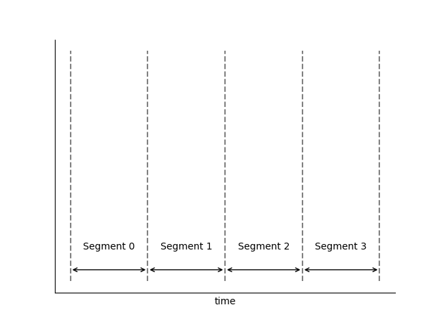
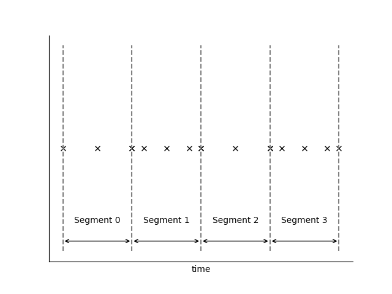
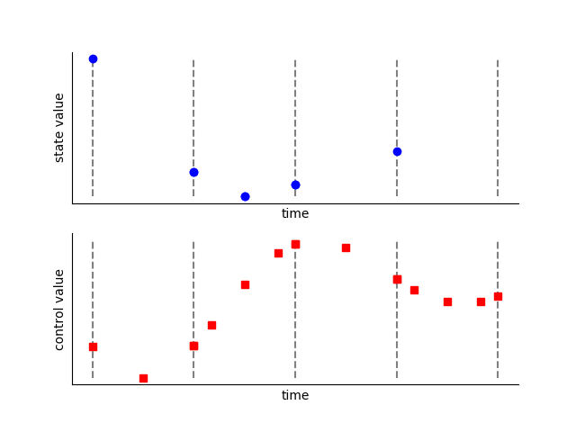
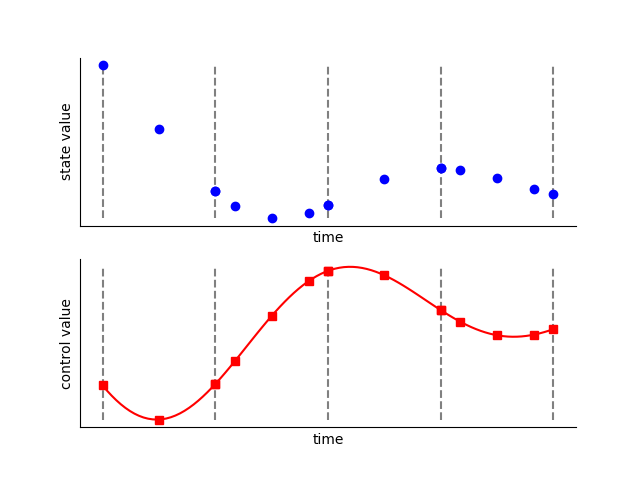
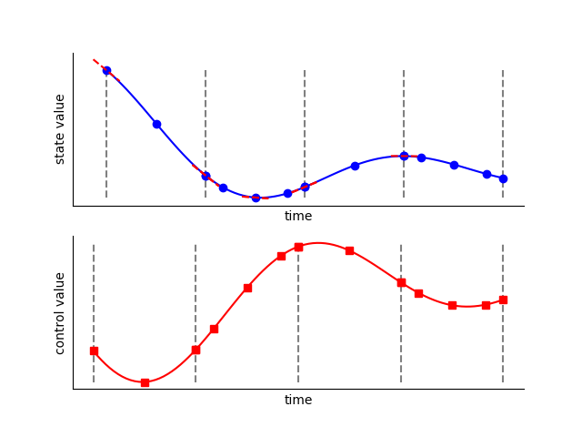
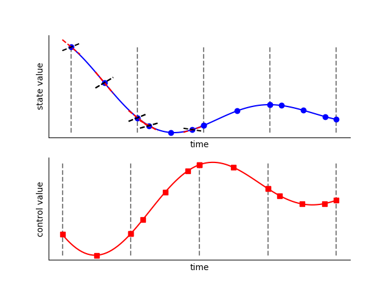

High-Order Gauss-Lobatto Collocation
------------------------------------

High-order Gauss-Lobatto is a generalization of the Hermite-Simpson optimization scheme developed
by Herman and Conway [HermanConway1996]_.

**Step 1:  Phase Segmentation**

Each phase is divided into polynomial segments.  The span and polynomial order of each segment
define the "grid" within each segment.  The grid can be specified by the user or set by an
automatic grid refinement algorithm, depending on the accuracy required.

**Step 2:  Discretization**

Each segment is discretized by applying the Legendre-Gauss-Lobatto (LGL) nodes to normalized
segment space (:math:`\tau_{s}`)

**Step 3:  Input**

The time of the phase is specified using the initial time (:math:`t_{initial}`) and duration
(:math:`t_{duration}`) of the phase.  This sets the value of time at each *node* within the phase.

The value of each state is given at each state discretization node (the even-index LGL nodes of
each segment).  The user typically provides an initial guess for these values.  During optimization
these are design variables.

The value of each dynamic control is given at every node in the segment.
The user typically provides an initial guess for these values.  During optimization these
are design variables.

.. note::

    At each segment boundary the value of each state and control is given twice by default.
    The phase will automatically add constraints to ensure continuity at the segment boundary.
    Optionally, the user may provide the argument `compressed=True` upon Phase initialization,
    which specifies that state values are not to be given twice at each segment boundary.
    While this removes some variables from the problem, our experience has shown that the penalty
    is minimal, while using an 'uncompressed' transcription provides for better parallelization.

**Step 4:  Control Rate Interpolation**

With the control values known at all nodes in the grid, we can form a Lagrange interpolation
polynomial to compute the derivatives of the control at all nodes.  This allows us to use
control rates as inputs to the ODE.  In Dymos the first and second derivatives of the
controls are automatically computed.

.. note::

   In a segment with 3 LGL nodes, the states are interpolated from values *and rates* at the two
   endpoint nodes, resulting in a 3th order polynomial.  The controls are interpolated from their
   values at all three nodes, resulting in a 2nd order polynomial.  Enforcing continuity in the
   second derivative of a control at segment bounds is not advisable when using High Order
   Gauss Lobatto with low-order segments.

**Step 5:  Evaluation of the ODE at the State Discretization Nodes**

On each segment, the state and control time histories are assumed to be polynomials.  For a
segment with three nodes, the two endpoints are the state discretization nodes.  The given ODE
is evaluated here (remember, thus far we know the values of the states at the discretization
nodes and the values of time and the controls at all nodes).

**Step 6:  State Interpolation**

Using the state and state rates at the discretization nodes, form a Hermite interpolating
polynomial, giving the approximate state values and rates at the collocation nodes.

**Step 7:  Evaluation of the ODE at the Collocation Nodes**

The given ODE is evaluated a second time, this time at the collocation nodes
(the odd-index LGL nodes), giving the computed state rates.

**Step 7:  Evaluation of the Collocation Defects**

The collocation *defects* (:math:`\Delta`) are computed by finding the difference between the approximate state values
at the collocation nodes (from Step 5) and the computed values at the collocation nodes (from Step 6).

.. math::

   \Delta = f_{ode}(x_{col}, t_{col}, u_{col}) - x'_{col}

If uncompressed transcription is used, the continuity defects involving the states, controls, and
(optionally) control rates are also evaluated here.

**Step 8:  Iterate Steps 3 Through 7**

During optimization, the optimizer updates the design variables (initial time, final time,
state values at the discretization nodes, and control values at all nodes) until the constraints
posed in Step 7 are satisfied.  At this point the time-history of the state variable is *feasible*
,provided the accuracy of our grid is sufficient.  If we have one or more control variable then
we may have an infinite number of feasible trajectories.  In that case the optimizer will work to
find the time history that minimizes our objective function.

Advantages of High-Order Gauss-Lobatto Collocation
^^^^^^^^^^^^^^^^^^^^^^^^^^^^^^^^^^^^^^^^^^^^^^^^^^

- Provides collocated dyanamics at the endpoints of the segment.
  No node has an "undefined" control value as is the case in the Radau Pseudospectral Method.

Disdvantages of High-Order Gauss-Lobatto Collocation
^^^^^^^^^^^^^^^^^^^^^^^^^^^^^^^^^^^^^^^^^^^^^^^^^^^^

- Requires an interpolation step that can sometimes make it less amenable to poor initial guesses.
- Requires two steps to evaluate the dynamics at all nodes in the phase (first the discretization
  nodes, then the collocation nodes).  This poses a performance bottleneck when using
  parallelization to evaluate the dynamics.
- State path constraints cannot be imposed with simple bounds on states, since the interpolation
  step may interpolate a state value beyond the limits imposed on the design values provided at
  the state discretization nodes.

References
^^^^^^^^^^
.. [HermanConway1996] Herman, Albert L, and Bruce A Conway. “Direct Optimization Using Collocation Based on High-Order Gauss-Lobatto Quadrature Rules.” Journal of Guidance, Control, and Dynamics 19.3 (1996): 592–599.
