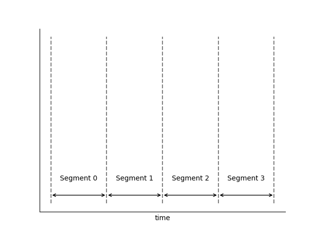
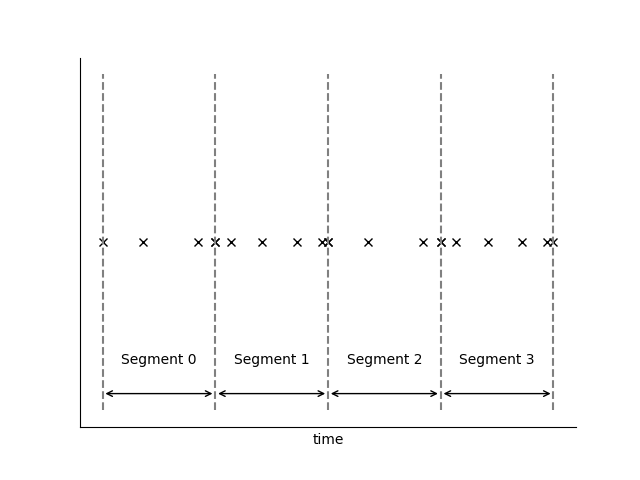
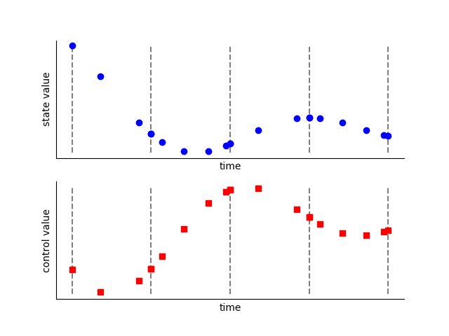
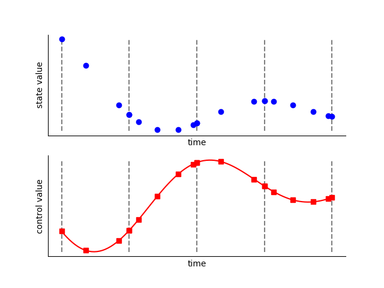
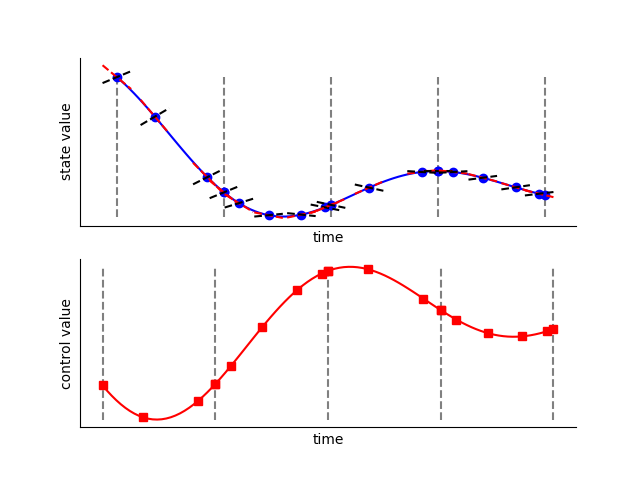

Radau Pseudospectral Method
---------------------------

The Radau-Pseudospectral method performs collocation of an optimal control problem by collocating
the dynamics at the Legendre Gauss Radau nodes [Garg2010]_.  The general procedure
for this method is as follows:

#. The phase is divided into polynomial segments on which the dynamics are assumed to be continuous.
#. The states and controls are provided by the optimizer at the LGR nodes *plus the endpoint* of each segment.
#. Given the state values, form a Lagrange polynomial on each segment and take its derivative to compute the approximate state rates at the collocation nodes.
#. The dynamics are evaluated at the collocation nodes (the LGR nodes not including the endpoint), giving the computed state rates.
#. The difference between the approximated state rates and computed state rates are given to the optimizer as constraints.
#. The optimizer iterates on the state and control values until the optimality conditions are satisfied.

**Step 1:  Phase Segmentation**

Each phase is divided into polynomial segments.  The span and polynomial order of each segment
define the "grid" within each segment.  The grid can be specified by the user or set by an
automatic grid refinement algorithm, depending on the accuracy required.

**Step 2:  Discretization**

Each segment is discretized by applying the Legendre-Gauss-Radau (LGR) nodes to normalized
segment space (:math:`\tau_{s}`)

**Step 3:  Input**

The time of the phase is specified using the initial time (:math:`t_{initial}`) and duration
(:math:`t_{duration}`) of the phase.  This sets the value of time at each *node* within the phase.

The value of each state is given at each state discretization node (the even-index LGL nodes of
each segment).  The user typically provides an initial guess for these values.  During optimization
these are design variables.

The value of each dynamic control is given at every node in the segment.
The user typically provides an initial guess for these values.  During optimization these
are design variables.

.. note::

    At each segment boundary the value of each state and control is given twice by default.
    The phase will automatically add constraints to ensure continuity at the segment boundary.
    Optionally, the user may provide the argument `compressed=True` upon Phase initialization,
    which specifies that state values are not to be given twice at each segment boundary.
    While this removes some variables from the problem, our experience has shown that the penalty
    is minimal, while using an 'uncompressed' transcription provides for better parallelization.

**Step 4:  Control Rate Interpolation**

With the control values known at all nodes in the grid, we can form a Lagrange interpolation
polynomial to compute the derivatives of the control at all nodes.  This allows us to use
control rates as inputs to the ODE.  In Dymos the first and second derivatives of the
controls are automatically computed.

.. note::

   In a segment with 3 LGL nodes, the states are interpolated from values *and rates* at the two
   endpoint nodes, resulting in a 3th order polynomial.  The controls are interpolated from their
   values at all three nodes, resulting in a 2nd order polynomial.  Enforcing continuity in the
   second derivative of a control at segment bounds is not advisable when using High Order
   Gauss Lobatto with low-order segments.

**Step 5:  State Rate Interpolation**

Using the state and state rates at the discretization nodes, form a Langrange interpolating
polynomial, giving the approximate state rates at the collocation nodes.

.. image:: figures/radau-pseudospectral/05_state_rate_interpolation.png
   :scale: 100 %
   :alt: The state rate time histories are interpolated.
   :align: center

**Step 6:  Evaluation of the ODE at All Nodes**

The given ODE is evaluated at all nodes.  Evaluation at the collocation nodes (which don't include
the endpoint) provide collocation defects.  Evaluation at the endpoint provides values that are
potentially needed as boundary constraints or objectives.

**Step 7:  Evaluation of the Collocation Defects**

The collocation *defects* (:math:`\Delta`) are computed by finding the difference between the approximate state values
at the collocation nodes (from Step 5) and the computed values at the collocation nodes (from Step 6).

.. math::

   \Delta = f_{ode}(x_{col}, t_{col}, u_{col}) - x'_{col}

If uncompressed transcription is used, the continuity defects involving the states, controls, and
(optionally) control rates are also evaluated here.

**Step 8:  Iterate Steps 3 Through 7**

During optimization, the optimizer updates the design variables (initial time, final time,
state values at the discretization nodes, and control values at all nodes) until the constraints
posed in Step 7 are satisfied.  At this point the time-history of the state variable is *feasible*
,provided the accuracy of our grid is sufficient.  If we have one or more control variable then
we may have an infinite number of feasible trajectories.  In that case the optimizer will work to
find the time history that minimizes our objective function.

- Requires an interpolation step that can sometimes make it less amenable to poor initial guesses.
- Requires two steps to evaluate the dynamics at all nodes in the phase (first the discretization
  nodes, then the collocation nodes).  This poses a performance bottleneck when using
  parallelization to evaluate the dynamics.
- State path constraints cannot be imposed with simple bounds on states, since the interpolation
  step may interpolate a state value beyond the limits imposed on the design values provided at
  the state discretization nodes.

Advantages of the Radau Pseudospectral Method
^^^^^^^^^^^^^^^^^^^^^^^^^^^^^^^^^^^^^^^^^^^^^
- No interpolation of states or controls is necessary, since the collocation nodes are a subset of the state discretization nodes.
- This method can evaluate the dynamics at all nodes in a phase in a single pass, while the Gauss-Lobatto method requires two passes (evaluate, interpolate, evaluate).  This removes a bottleneck when using parallelization to evaluate the dynamics.

Disdvantages of the Radau Pseudospectral Method
^^^^^^^^^^^^^^^^^^^^^^^^^^^^^^^^^^^^^^^^^^^^^^^
- One point in a phase is not subject to collocation (either the initial point or the end point).  As a result,
  the control values at that node have less (or zero) impact on the collation defect constraints and are meaningless.  Various methods
  exist for working around this deficiency, such as constraining the control value or derivatives at the endpoint, or by running the
  optimization with both in LGR and reversed LGR (rLGR) modes and then taking the valid control from each.

References
^^^^^^^^^^
.. [Garg2010] Garg, Divya et al. “A Unified Framework for the Numerical Solution of Optimal Control Problems Using Pseudospectral Methods.” Automatica 46.11 (2010): 1843–1851.
