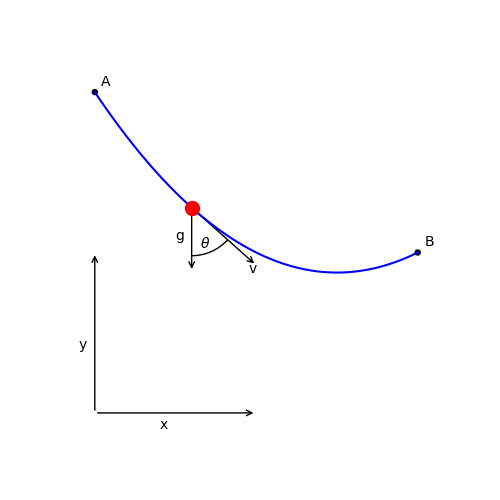

=================================================
Brachistochrone: A simple optimal control example
=================================================

We seek to find the optimal shape of a wire between two points (A and B) such that a bead sliding
without friction along the wire moves from point A to point B in minimum time.

We minimize the final time, :math:`t_f`, by varying the dynamic control, :math:`\theta`, subject to the dynamics:

.. math ::
    \frac{d x}{d t} &= v \sin(\theta) \\
    \frac{d y}{d t} &= v \cos(\theta) \\
    \frac{d v}{d t} &= g \cos(\theta)

The initial conditions are

.. math ::
    x_0 &= 0 \\
    y_0 &= 10 \\
    v_0 &= 0, \\

and the final conditions are

.. math ::
    x_f &= 10 \\
    y_f &= 5 \\
    v_f &= \mathrm{free}

1. The ODE System: brachistochrone_ode.py
-----------------------------------------

.. embed-code::
   examples.brachistochrone.test.test_brachistochrone_quick_start.BrachistochroneODE
   :layout: code

2. Setting up and solving the optimal control problem
-----------------------------------------------------

.. embed-code::
   dymos.examples.brachistochrone.test.test_brachistochrone_quick_start.TestBrachistochroneQuickStart.test_brachistochrone_quick_start
   :layout: code, plot
