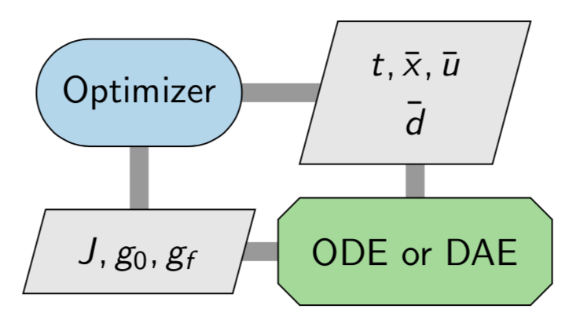
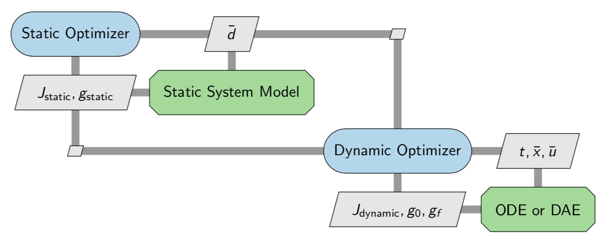
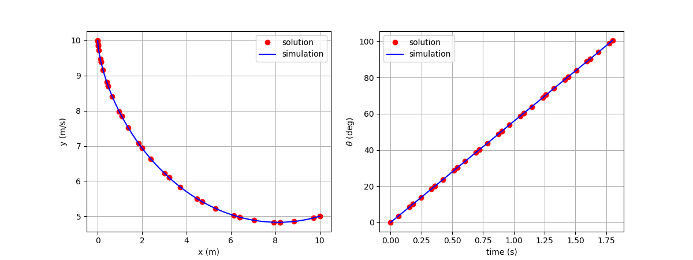

# Summary

Dymos is a library for optimizing control schedules for dynamic systems --- sometimes referred to as  optimal control or trajectory optimization.
There are a number of other optimal control libraries that tackle similar kinds of problems, such as OTIS4 [@Paris2006], GPOPS-II [@Patterson2014GPOPSII],and CASADI [@Andersson2018].
These tools all rely on gradient based optimization to solve optimal control problems, though their methods of computing the gradients vary. 
Dymos is built on top of the OpenMDAO framework[@Gray2019a] and supports its modular derivative system which allows users to mix-and-match from finite-differencing, complex-step, hand-differentiated, and algorithmic differentiation. 
This flexibility allows Dymos to efficiently solve optimal control problems constructed with both ordinary differential equations (ODE) and differential algebraic equations (DAE). 

Dymos can also help solve more general optimization problems where dynamics are only one part in a larger system level model with additional --- potentially computationally expensive --- calculations that come before and after the dynamic calculations.  
These broader problems are commonly referred to co-design, controls-co-design, and multidisciplinary design optimization.
Dymos provides specific APIs and features that make it possible to integrate traditional optimal-control models into a co-design context, while still supporting analytic derivatives that are necessary for computational efficiency in these complex use cases. 
An example of a co-design problem that was solved with Dymos is the coupled trajectory-thermal design of an electric vertical takeoff and landing aircraft where the thermal management and propulsion systems were designed simultaneously with the flight trajectories to ensure no components overheated[@Hariton2020a].


# Difference between optimal-control and co-design
In the most general sense, both optimal-control and co-design problems are both are numerically valid ways of optimizations problems involving ordinary differential equations (ODE) or differential algebraic equations (DAE).  
A general problem formulation will look like this:  

\begin{align*} 
\mathrm{Minimize}& \qquad \mathrm{J} = f_{obj}(\bar{x},t,\bar{u},\bar{d}) \\
\mathrm{With Respect To:} & t, \bar{x}, \bar{u}, \bar{d}
\mathrm{Subject , to:}& \\
\mathrm{Dynamic , Constraints:}& \qquad \dot{\bar{x}} = f_{ode}(\bar{x},t,\bar{u},\bar{d}) \\
\mathrm{Time:}& \qquad {t}{lb} \leq t \leq {t}{ub} \\
\mathrm{State , Variables:}& \qquad \bar{x}{lb} \leq \bar{x} \leq \bar{x}{ub} \\
\mathrm{Dynamic , Controls:}& \qquad \bar{u}{lb} \leq \bar{u} \leq \bar{u}{ub} \\ 
\mathrm{Design , Parameters:}& \qquad \bar{d}{lb} \leq \bar{d} \leq \bar{d}{ub} \\ 
\mathrm{Initial , Boundary , Constraints:}& \qquad \bar{g}{0,lb} \leq g_{0}(\bar{x}0,t_0,\bar{u}0, \bar{d}) \leq \bar{g}{0,ub} \\
\mathrm{Final , Boundary , Constraints:}& \qquad \bar{g}{f,lb} \leq g_{f}(\bar{x}f,t_f,\bar{u}f, \bar{d}) \leq \bar{g}{f,ub} \\ 
<!-- \mathrm{Path , Constraints:}& \qquad \bar{p}{f,lb} \leq p_{f}(\bar{x},t,\bar{u},\bar{d}) \leq \bar{p}_{f,ub} 
 -->
 \end{align*}

In the mathematical sense what distinguishes optimal-control from co-design is the particulars of which design variables and constraints are actually considered. 
Pure optimal control problems deal with an already designed system and seek to maximize performance by adjusting dynamic quantities ($t, \bar{x}, \bar{u}$) such as position, speed, fuel-burned, battery state of charge, etc. 
Co-design problems simultaneously vary the design parameters of a system ($\bar{d}$) and its dynamic behavior ($t, \bar{x}, \bar{u}$) to reach maximum performance. 


In practice, the difference between optimal-control and co-design is not mathematical but instead more related to how the static and dymamic calculations are implemented and how complex each of them are. 
For very simple physical design parameters (e.g. the radius of a cannon ball, spring constants, linkage lengths, etc) it is common to integrate the design calculations directly into the ODE.
Even though the calculations are static in nature, they can easily be coded as part of the ODE and still fits well into the optimal-control paradigm. 
The optimization structure thus looks like this: 



However, not all calculations are can be handled in this way. 
When you need to split calculations up into a static component and a dynamic component, this would typically be called co-design. 
For example if the physical design problem included shaping of an airfoil using expensive numerical solutions to partial differential equations to predict drag, then you would not want to embed that PDE solver into the dynamic model. 
Instead you could set up a coupled model with the PDE solver going first, and passing a table of data to be interpolated to the dynamic model. 
Traditionally, this kind of co-design process would be done via sequential optimization with an manual outer design iteration between teams. 
One group would come up with a physical design, using their own internal optimization setup and then a second would take that and generate optimal control profiles for it. 
This kind of iterative sequential optimization look like this: 


Dymos can support sequential co-design, but its unique value is that it also enables a more tightly coupled co-design process with a single top level optimizer handling both parts of the problem simultaneously. 
Coupled co-design is particularly challenging because it requires propagating derivative information from the static analysis to the dynamic analysis in an efficient way. 


<!-- Optimal control software typically requires that the dynamics of the system be defined as a set of ordinary differential equations (ODE) that use explicit functions to compute the rates of the state variables to be time-integrated.
Sometimes the dynamics are instead posed as a set of differential algebraic equations (DAE), where some residual equations need to be satisfied implicitly in order to solve ODE.
One application of this approach is the method of differential inclusions, in which the state time-history is posed as a dynamic control, and the traditional control variables needed to achieve that trajectory are found using a nonlinear solver within the ODE [@Seywald1994].
Support for implicit calculations gives users more freedom to pose dynamics in more natural ways, but typically causes numerical and computational cost challenges in an optimization context, especially when finite-differences are used to compute derivatives for the optimizer.
Some optimal control libraries tackle this numerical challenge with a monolithic algorithmic differentiation[@griewank2003mathematical] approach.
While effective, the monolithic nature is both less efficient[@mader2008adjoint; @kenway2019effective] and less flexible.

Instead, Dymos uses a modular approach that allows users to select any combination of finite-difference, complex-step [@Martins2003CS], algorithmic differentiation, and hand differentiation that suits their modeling needs.
This flexibility is achieved by leveraging the data passing and efficient differentiation features of NASA's OpenMDAO framework[@Gray2019a].
OpenMDAO efficiently computes derivatives for multidisciplinary optimization using techniques based on the research of Hwang and Martins [@hwang2018b].
Dymos extends OpenMDAO by adding differentiated time-integration schemes along with the necessary APIs for users to plug their ODEs and DAEs into those schemes.
It also provides further APIs to enable the input and output of information from the optimal control problem, in order to couple with the physical design models.
Some of the original methods and use-cases which drove the development of Dymos were first published by Falck and Gray in 2019[@falck2019].
 -->

## The dymos perspective on optimal control

Dymos breaks the trajectory of a system into chunks of time called _phases_.
Breaking the trajectory into phases provides several capabilities.
Intermediate constraints along a trajectory can be enforced by applying boundary constraint to a phase that begins or ends at the time of interest.
For instance, the optimal trajectory of a launch vehicle may be required to ascend vertically to clear a launch tower before it pitches over on its way to orbit.
Path constraints can be applied within each phase to bound some performance parameter within that phase.
For example, reentry vehicles may need to adjust their trajectory to limit aerodynamic heating.

Each phase in a trajectory can also use its own separate ODE.
For instance, an aircraft with vertical takeoff and landing capability may use different ODEs for vertical flight and horizontal flight.
ODE's are implemented as standard OpenMDAO models which are passed to phases at instantiation time with some additional annotations to identify the states, state-rates, and control inputs.
To use separate ODE's in separate phases, the user simply provides different OpenMDAO models to each phase. 

Every phase uses its own specific time discretization tailored to the dynamics in that chunk of the time-history. 
If one part of a trajectory has fast dynamics and another has slow dynamics, the time history can be broken into two phases with separate time discritizations.
The available time discretization schemes in Dymos are based on pseudospectral methods, using two common direct collocation transcriptions:
the high-order Gauss-Lobatto transcription [@Herman1996] and the Radau pseudospectral method [@Garg2009].
Both implicit and explicit forms of these transcriptions are supported.
The explicit forms can be used to build single or multiple-shooting style problem formulations.
The implicit forms can be used to construct two point boundary value problems.
Transcriptions are built to be totally independent of the ODE implementation, and nearly transparent to the user. 
This means that switching transcriptions requires very minor code changes - typically a single line in the run-script.

Dymos does not ship with its own built in optimizer. 
It relies on whatever optimizers you have available in your OpenMDAO installation. 
OpenMDAO ships with an interface to the optimizers in SciPy [@2020SciPy-NMeth], 
and an additional wrapper for the pyoptsparse [@Wu_pyoptsparse_2020] library which has more powerful optimizer options such as SNOPT [@GilMS05] and IPOPT [@wachter2006].
OpenMDAO also allows users to integrate their own optimizer of choice, which Dymos can then seamlessly use with without any additional modifications.
For simple problems, Scipy's SLSQP optimizer generally works fine.
On more challenging optimal-control problems, higher quality optimizers are important for getting good performance.

## Statement of Need

When dealing with the design of complex systems, there are two approaches: collaborative optimization or coupled co-design [@allison2004complex].
The best choice depends on the degree of interaction, or coupling, between various sub-systems. 
In the case where you have a system where performance is heavily influenced by its transient behavior, then the dynamic behavior becomes a critical subsystem. 
If the coupling is strong in this case, a co-design (a.k.a. controls-co-design; a.k.a. multidisciplinary design optimization) approach is necessary to achieve the best performance [@garciasans2019].

Though there are a number of effective optimal control libraries, they tend to assume that they are on top of the modeling stack. 
Hence, they frame every optimization problem as if it was a pure optimal-control problem. 
This poses large challenges when expanding to co-design type problems, which often do not fit well within the pure optimal-control paradigm. 

Dymos provides a set of unique capabilities that make co-design possible via efficient gradient-based optimization methods.
It provides differentiated time-integration schemes that can generate transient models from user provided ODEs, 
along with APIs that enable users to couple these transient models with other models to form the co-design system while carrying the differentiation through that coupling.
It also supports efficient differentiation of complex ODE's that include implicit relationships, such as differential algebraic equations. 
These two features combined make Dymos capable of handling co-design problems in a manner that is more efficient than a pure optimal-control approach. 


## Selected applications of dymos

Dymos has been used to demonstrate the coupling of flight dynamics and subsystem thermal constraints in electrical aircraft applications [@Falck2017a; @Hariton2020a].
NASA's X-57 "Maxwell" is using dymos for mission planning to maximize data collection while abiding the limits of battery storage capacity and subsystem temperatures [@Schnulo2018a; @Schnulo2019a].
Other authors have used dymos to perform studies of aircraft acoustics [@Ingraham2020a] and the the design of supersonic aircraft with thermal fuel management systems [@Jasa2018a].

## Example usage of dymos

As a simple use-case of dymos, consider the classic brachistochrone optimal control problem.
In this problem, we seek the shape of a frictionless wire strung between two points of different heights such that a bead sliding along the wire moves from the first point to the second point in minimum time.
To find the solution in dymos, we first define the ordinary differential equations that govern the motion of the bead.

```python
import numpy as np
import openmdao.api as om
import dymos as dm
import matplotlib.pyplot as plt


# First define a system which computes the equations of motion
class BrachistochroneEOM(om.ExplicitComponent):
    def initialize(self):
        self.options.declare('num_nodes', types=int)

    def setup(self):
        nn = self.options['num_nodes']

        # Inputs
        self.add_input('v', val=np.zeros(nn), units='m/s',
                       desc='velocity')

        self.add_input('theta', val=np.zeros(nn), units='rad',
                       desc='angle of wire')

        self.add_output('xdot', val=np.zeros(nn), units='m/s',
                        desc='velocity component in x')

        self.add_output('ydot', val=np.zeros(nn), units='m/s',
                        desc='velocity component in y')

        self.add_output('vdot', val=np.zeros(nn), units='m/s**2',
                        desc='acceleration magnitude')

        # Setup partials for the analytic derivatives
        # These all have diagonal partial-derivative jacobians
        ar = np.arange(self.options['num_nodes'])

        self.declare_partials(of='vdot', wrt='theta', rows=ar, cols=ar)
        self.declare_partials(of='xdot', wrt='*', rows=ar, cols=ar)
        self.declare_partials(of='ydot', wrt='*', rows=ar, cols=ar)

    def compute(self, inputs, outputs):
        v, theta = inputs.values()

        outputs['vdot'] = 9.80665 * np.cos(theta)
        outputs['xdot'] = v * np.sin(theta)
        outputs['ydot'] = -v * np.cos(theta)

    def compute_partials(self, inputs, jacobian):
        v, theta = inputs.values()

        cos_theta = np.cos(theta)
        sin_theta = np.sin(theta)

        jacobian['vdot', 'theta'] = -9.80665 * sin_theta

        jacobian['xdot', 'v'] = sin_theta
        jacobian['xdot', 'theta'] = v * cos_theta

        jacobian['ydot', 'v'] = -cos_theta
        jacobian['ydot', 'theta'] = v * sin_theta
```

Having defined the ODE, we can now use Dymos to find the optimal time-history of the angle between the nadir and the wire (theta).

```python

p = om.Problem(model=om.Group())

# Define a Trajectory object
traj = dm.Trajectory()
p.model.add_subsystem('traj', subsys=traj)

# Define a Dymos Phase object with GaussLobatto Transcription
phase = dm.Phase(ode_class=BrachistochroneEOM,
                 transcription=dm.GaussLobatto(num_segments=10, order=3))
traj.add_phase(name='phase0', phase=phase)

# Set the time options
phase.set_time_options(fix_initial=True,
                       duration_bounds=(0.5, 10.0))

# Set the state options
phase.add_state('x', rate_source='xdot',
                fix_initial=True, fix_final=True)
phase.add_state('y', rate_source='ydot',
                fix_initial=True, fix_final=True)
phase.add_state('v', rate_source='vdot',
                fix_initial=True, fix_final=False)

# Define theta as a control.
phase.add_control(name='theta', units='rad',
                  lower=0, upper=np.pi)

# Minimize final time.
phase.add_objective('time', loc='final')

# Set the driver.
p.driver = om.ScipyOptimizeDriver()

# Allow OpenMDAO to automatically determine our sparsity pattern.
# Doing so can significant speed up the execution of dymos.
p.driver.declare_coloring()

# Setup the problem
p.setup()

# Now that the OpenMDAO problem is setup, we can guess the
# values of time, states, and controls.
p.set_val('traj.phase0.t_duration', 2.0)

# States and controls here use a linearly interpolated
# initial guess along the trajectory.
p.set_val('traj.phase0.states:x',
          phase.interpolate(ys=[0, 10], nodes='state_input'),
          units='m')

p.set_val('traj.phase0.states:y',
          phase.interpolate(ys=[10, 5], nodes='state_input'),
          units='m')

p.set_val('traj.phase0.states:v',
          phase.interpolate(ys=[0, 5], nodes='state_input'),
          units='m/s')

p.set_val('traj.phase0.controls:theta',
          phase.interpolate(ys=[90, 90], nodes='control_input'),
          units='deg')

# Run the driver to solve the problem
p.run_driver()

# Check the validity of our results by using
# scipy.integrate.solve_ivp to integrate the solution.
sim_out = traj.simulate()
```

Plotting the resulting state and controls gives the following:



# Acknowledgements

Dymos was developed with funding from NASA's Transformational Tools and Technologies ($T^3$) Project.

# References
