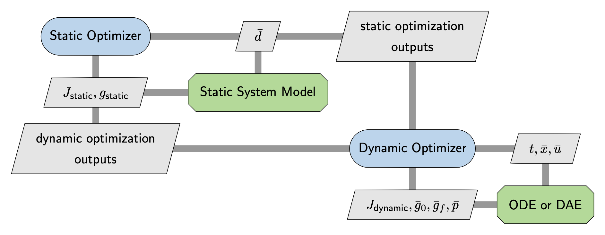

# Summary

Dymos is a library for optimizing control schedules for dynamic systems --- sometimes referred to as  optimal control or trajectory optimization.
There are a number of other optimal control libraries that tackle similar kinds of problems, such as OTIS4 [@Paris2006], GPOPS-II [@Patterson2014GPOPSII],and CASADI [@Andersson2018].
These tools all rely on gradient-based optimization to solve optimal control problems, though their methods of computing the gradients vary. 
Dymos is built on top of the OpenMDAO framework [@Gray2019a] and supports its modular derivative system which allows users to mix-and-match from finite-differencing, complex-step, hand-differentiated, and algorithmic differentiation.
This flexibility allows Dymos to efficiently solve optimal control problems constructed with both ordinary differential equations (ODE) and differential-algebraic equations (DAE). 

Dymos can also help solve more general optimization problems where dynamics are only one part in a larger system-level model with additional --- potentially computationally expensive --- calculations that come before and after the dynamic calculations.
These broader problems are commonly referred to as co-design, controls-co-design, and multidisciplinary design optimization.
Dymos provides specific APIs and features that make it possible to integrate traditional optimal-control models into a co-design context, while still supporting analytic derivatives that are necessary for computational efficiency in these complex use cases.
An example of a co-design problem that was solved with Dymos is the coupled trajectory-thermal design of an electric vertical takeoff and landing aircraft where the thermal management and propulsion systems were designed simultaneously with the flight trajectories to ensure no components overheated [@Hariton2020a].

# Difference between optimal-control and co-design

Optimal-control and co-design problems deal with dynamic systems.
The evolution of the states over time is governed by an ordinary differential equation (ODE) or differential-algebraic equation (DAE):
\begin{align*}
  \dot{\bar{x}} = f_{ode}(\bar{x},t,\bar{u},\bar{d})
\end{align*}
Here, $\bar{x}$ is a vector of time-varying state variables whose behavior is affected by time ($t$), a vector of dynamic controls ($\bar{u}$), and a vector of static design parameters ($\bar{d}$).


To optimize a dynamic system we also need to account for the objective function ($J$):
\begin{align*}
  \mathrm{J} = f_{obj}(\bar{x},t,\bar{u},\bar{d})
\end{align*}
In addition, there are constraints that typically need to be enforced: 
\begin{align*}
  \mathrm{Time:}& \qquad {t}_{lb} \leq t \leq {t}_{ub} \\
  \mathrm{State \, Variables:}& \qquad \bar{x}_{lb} \leq \bar{x} \leq \bar{x}_{ub} \\
  \mathrm{Dynamic \, Controls:}& \qquad \bar{u}_{lb} \leq \bar{u} \leq \bar{u}_{ub} \\
  \mathrm{Design \, Parameters:}& \qquad \bar{d}_{lb} \leq \bar{d} \leq \bar{d}_{ub} \\
  \mathrm{Initial \, Boundary \, Constraints:}& \qquad \bar{g}_{0,lb} \leq g_{0}(\bar{x}_0,t_0,\bar{u}_0, \bar{d}) \leq \bar{g}_{0,ub} \\
  \mathrm{Final \, Boundary \, Constraints:}& \qquad \bar{g}_{f,lb} \leq g_{f}(\bar{x}_f,t_f,\bar{u}_f, \bar{d}) \leq \bar{g}_{f,ub} \\
  \mathrm{Path \, Constraints:}& \qquad \bar{p}_{lb} \leq p(\bar{x},t,\bar{u},\bar{d}) \leq \bar{p}_{ub} \\
\end{align*}


In the mathematical sense what distinguishes optimal control from co-design is the particulars of which design variables and constraints are actually considered by the optimization.
Pure optimal-control problems deal with a system of fixed design and seek to maximize performance by adjusting dynamic quantities ($t, \bar{x}, \bar{u}$) such as position, speed, fuel-burned, and battery state-of-charge.
Co-design problems simultaneously vary the static design parameters of a system ($\bar{d}$) and its dynamic behavior ($t, \bar{x}, \bar{u}$) to reach maximum performance. 

In practice, the mathematical distinction is too rigid and a more practical distinction is made based on where the static and dynamic calculations are implemented and how complex each of them is. 
For very simple physical design parameters (e.g. the radius of a cannon ball, spring constants, linkage lengths, etc) it is common to integrate the design calculations directly into the ODE.
Even though the calculations are static in nature, they can easily be coded as part of the ODE and still fit well into the optimal-control paradigm.
The optimization structure thus looks like this: 

{width=45%}

However, not all problems can be handled with such a compact implementation.
For example if the physical design problem included shaping of an airfoil using expensive numerical solutions of partial differential equations (PDE) to predict drag, then one would not want to embed that PDE solver into the dynamic model.
Instead the user could set up a coupled model with the PDE solver going first, and passing a table of data to be interpolated to the dynamic model.
This effectively splits calculations up into static and dynamic components.
This implementation structure is called co-design. 

Traditionally, this co-design implementation would be done via sequential optimization with a manual outer design iteration between the static and dynamic models, potentially with different teams of people working on each one.
One team would come up with a physical design using their own internal optimization setup. 
A second team takes the design and generates optimal-control profiles for it. 
Of course, the iterations do not need to be manual.
It is also possible to set up an iterative loop around static and dynamic models to converge the problem numerically. 
A sequential co-design implementation looks like this:

{width=100%}

Dymos can support sequential co-design, but its unique value is that it also enables a more tightly-coupled
co-design process with a single top level optimizer handling both parts of the problem simultaneously. 

{width=75%}

Compared to sequential co-design, coupled co-design offers the potential to find better designs with much lower computational cost. 
However, it is also more challenging to implement because the top-level optimizer requires derivatives to be propagated between the static and dynamic parts of the model. 
Dymos overcomes this difficulty by providing APIs to exploit OpenMDAO's analytic derivative functionality at the model level. 
Data can be passed from the static model to the dynamic model and vice versa, allowing the construction of the coupled model for optimization. 

# ODE versus DAE

Optimal-control software typically requires that the dynamics of the system be defined as a set of ordinary differential equations (ODE) that use explicit functions to compute the rates of the state variables to be time-integrated.
Sometimes the dynamics are instead posed as a set of differential-algebraic equations (DAE), where some residual equations need to be satisfied implicitly in order to solve for the state rates. 
From the perspective of an optimal-control or co-design problem both ODE and DAE formulations provide state rates that need to be integrated over time. 
The difference is that ODEs are explicit functions which are relatively easy to differentiate, but DAEs are implicit functions which are much more difficult to differentiate. 
Since the derivatives are needed to perform optimization, DAEs are more challenging to optimize. 

One relatively common use case for DAEs is differential inclusions, in which the state trajectory is posed as a dynamic control and the traditional control schedule needed to achieve that trajectory is found using a nonlinear solver within the dynamic model [@Seywald1994].
For some problems this method provides a more natural and numerically-beneficial design space for the optimizer to traverse,
but the nonlinear solver poses numerical challenges for computing derivatives for the optimizer.
A simple approach to this is to just use finite-differences across the nonlinear solver, but this has been shown to be expensive and numerically unstable [@gray2014derivatives].
Another option, taken by some optimal control libraries, is to apply monolithic algorithmic differentiation [@griewank2003mathematical] across the nonlinear solver.
While it does provide accurate derivatives, the monolithic approach is expensive and uses a lot of memory [@mader2008adjoint; @kenway2019effective].
The most efficient approach is to use a pair of analytic derivative approaches called the direct and adjoint methods, which were generalized in a single unified derivative equation (UDE) by Hwang and Martins [@hwang2018b].

Dymos adopts the UDE approach, which uses a linear solver to compute total derivatives needed by the optimizer using only partial derivatives of the residual equations in the DAE.
This approach offers two key advantages. 
First, partial derivatives of the DAE residual equations are much less computationally challenging to compute. 
Second, by using the OpenMDAO underpinnings of Dymos, users can construct their DAE in a modular fashion and combine various methods of computing the partial derivatives via finite-difference, complex-step [@Martins2003CS], algorithmic differentiation, or hand differentiation as needed. 

## The Dymos perspective on optimal control

Dymos breaks the trajectory into portions of time called _phases_.
Breaking the trajectory into phases provides several capabilities.
Intermediate constraints along a trajectory can be enforced by applying a boundary constraint to a phase that begins or ends at the time of interest.
For instance, the optimal trajectory of a launch vehicle may be required to ascend vertically to clear a launch tower before it pitches over on its way to orbit.
Path constraints can be applied within each phase to bound some performance parameter within that phase.
For example, reentry vehicles may need to adjust their trajectory to limit aerodynamic heating.

Each phase in a trajectory can use its own separate ODE.
For instance, an aircraft with vertical takeoff and landing capability may use different ODEs for vertical flight and horizontal flight.
ODEs are implemented as standard OpenMDAO models which are passed to phases at instantiation time with some additional annotations to identify the states, state-rates, and control inputs.

Every phase uses its own specific time discretization tailored to the dynamics in that portion of the trajectory.
If one part of a trajectory has fast dynamics and another has slow dynamics, the time evolution can be broken into two phases with separate time discretizations.

In the optimal-control community there are a number of different techniques for discretizing the continuous optimal control problem into a form that can be solved by a nonlinear optimization algorithm; each one is called a transcription.
Dymos supports two different collocation transcriptions: high-order Gauss-Lobatto [@Herman1996] and Radau [@Garg2009].
Both of these represent state and control trajectories as piece-wise polynomials of at least 3rd order and are formulated in a way that makes it possible to efficiently compute the needed quantities to perform integration in a numerically rigorous fashion.

Dymos also allows the user to choose whether the optimization problem is solved using an explicit or implicit approach.
Some caution with terminology must be taken here because the term "implicit" is often used to describe time integration schemes (e.g. backwards Euler),
but that is not what is meant in an optimal-control context.
Here, explicit propagation is one where the full state trajectory is computed starting from the initial value and propagating forward or from the final value and propagating backward.
From the optimizer's perspective it will set values for the initial or final state ($\bar{x}$), the design parameters ($\bar{d}$), and the controls ($\bar{u}$) and can expect to be given a physically valid time evolution of the states as the output.
Wrapping an optimizer around an explicit propagation gives what is traditionally called a "shooting method" in the 
optimal-control world.
In contrast, implicit propagation used within an optimization does not provide valid trajectories on its own.
Instead, implicit methods add a discretized time-evolution of the state vector ($\bar{x}$) as an additional design variable to the optimizer and add an associated set of defect constraints that must be driven to zero to enforce physics at some set of discrete points in time where the ODE is evaluated.
The net effect is that the full state trajectory is only known once the optimization is fully converged.
In the context of the multidisciplinary design optimization field, explicit phases are similar to the multidisciplinary design feasible (MDF) optimization architecture and implicit phases are similar to the simultaneous analysis and design (SAND) optimization architecture [@Martins2013].

Both implicit and explicit phases are useful in different circumstances. 
Explicit propagation can seem to many like a more natural way to formulate the problem because it matches the way one would use time integration without optimization.
However, when used with optimization explicit propagation is more computationally expensive,
sensitive to singularities in the ODE, 
and potentially unable to converge to a valid solution. 
Implicit propagation tends to be less intuitive computationally, since it does not provide valid state histories without a converged optimization.
The advantages of implicit propagation are that it tends to be faster, more numerically stable, and more scalable --- though also highly sensitive to initial conditions and optimization scaling.

Dymos supports both explicit and implicit propagation for both its transcriptions,
and even allows mixtures of implicitly and explicitly propagated states within a phase.
This flexibility is valuable because it allows users to tailor their optimization to suit their needs. 
Switching transcriptions and changing from implicit to explicit requires very minor code changes --- typically a single line in the run-script.
Examples of how to swap between them are given in the code sample below. 

# Choice of optimization algorithm 

Dymos is not distributed with an optimizer, but relies on the optimizers that are available in the OpenMDAO installation.
OpenMDAO ships with an interface to the optimizers in SciPy [@2020SciPy-NMeth], 
and an additional wrapper for the pyoptsparse library [@Wu_pyoptsparse_2020] which has more powerful optimizer options such as SNOPT [@GilMS05] and IPOPT [@wachter2006].
OpenMDAO also allows users to integrate their own optimizer of choice, which Dymos can then seamlessly use with without any additional modifications.
For simple problems, Scipy's SLSQP optimizer generally works fine.
On more challenging optimal-control problems higher-quality optimizers are important for getting good performance.

Though one could technically choose any optimization algorithm, Dymos is designed to work primarily with gradient-based algorithms.
In general, optimal-control and co-design problems will have both a very large number of design variables and a very large number of constraints. 
Both of these issues make gradient-based methods the strongly-preferred choice. 
Gradient-free methods could potentially be used in certain narrow circumstances with problems built using purely explicit phases and set up intentionally to have a small set of design variables and constraints. 


## Statement of Need

When dealing with the design of complex systems that include transient behavior, co-design becomes critical [@garciasans2019].
Broadly there are two approaches: sequential co-design or coupled co-design [@Fathy2001;  @Peters2009].
The best choice depends on the degree of interaction, or coupling, between various sub-systems. 
If the coupling is strong a coupled co-design approach is necessary to achieve the best performance.

Though there are a number of effective optimal-control libraries, they tend to assume that they are on top of the modeling stack.
They frame every optimization problem as if it were a pure optimal-control problem, and hence are best suited to be used in a sequential co-design style. 
This poses large challenges when expanding to tightly-coupled problems, where the interactions between the static and dynamic systems are very strong. 

Dymos provides a set of unique capabilities that make coupled co-design possible via efficient gradient-based optimization methods.
It provides differentiated time-integration schemes that can generate transient models from user provided ODEs, 
along with APIs that enable users to couple these transient models with other models to form the co-design system while carrying the differentiation through that coupling.
It also supports efficient differentiation of DAEs that include implicit relationships, which allows for a much broader set of possible ways to pose transient models. 
These two features combined make Dymos capable of handling coupled co-design problems in a manner that is more efficient than a pure optimal-control approach. 


## Selected applications of Dymos

Dymos has been used to demonstrate the coupling of flight dynamics and subsystem thermal constraints in electrical aircraft applications [@Falck2017a; @Hariton2020a].
NASA's X-57 "Maxwell" is using Dymos for mission planning to maximize data collection while abiding the limits of battery storage capacity and subsystem temperatures [@Schnulo2018a; @Schnulo2019a].
Other authors have used Dymos to perform studies of aircraft acoustics [@Ingraham2020a] and the design of supersonic aircraft with thermal fuel management systems [@Jasa2018a].

## Optimal-control example: Brachistochrone

As a simple use case of Dymos, consider the classic brachistochrone optimal-control problem.
There is a bead sliding along a frictionless wire strung between two points of different heights, 
and we seek the shape of the wire such that the bead travels from start to finish in the shortest time. 
The time-varying control is the angle of the wire at each point in time and there are no design parameters, 
which makes this a pure optimal-control problem. 

\small
```python
import numpy as np
import openmdao.api as om
import dymos as dm
import matplotlib.pyplot as plt

# First define a system which computes the equations of motion
class BrachistochroneEOM(om.ExplicitComponent):
    def initialize(self):
        self.options.declare('num_nodes', types=int)

    def setup(self):
        nn = self.options['num_nodes']

        # Inputs
        self.add_input('v', val=np.zeros(nn), units='m/s', desc='velocity')
        self.add_input('theta', val=np.zeros(nn), units='rad',
                       desc='angle of wire')
        self.add_output('xdot', val=np.zeros(nn), units='m/s',
                        desc='x rate of change')
        self.add_output('ydot', val=np.zeros(nn), units='m/s',
                        desc='y rate of change')
        self.add_output('vdot', val=np.zeros(nn), units='m/s**2',
                        desc='v rate of change')

        # Ask OpenMDAO to compute the partial derivatives using complex-step
        # with a partial coloring algorithm for improved performance
        self.declare_partials(of='*', wrt='*', method='cs')
        self.declare_coloring(wrt='*', method='cs', show_summary=True)

    def compute(self, inputs, outputs):
        v, theta = inputs.values()
        outputs['vdot'] = 9.80665 * np.cos(theta)
        outputs['xdot'] = v * np.sin(theta)
        outputs['ydot'] = -v * np.cos(theta)

p = om.Problem()

# Define a Trajectory object
traj = p.model.add_subsystem('traj', dm.Trajectory())

# Define a Dymos Phase object with GaussLobatto Transcription
tx = dm.GaussLobatto(num_segments=10, order=3)
phase = dm.Phase(ode_class=BrachistochroneEOM, transcription=tx)

traj.add_phase(name='phase0', phase=phase)

# Set the time options
phase.set_time_options(fix_initial=True,
                       duration_bounds=(0.5, 10.0))
# Set the state options
phase.add_state('x', rate_source='xdot',
                fix_initial=True, fix_final=True)
phase.add_state('y', rate_source='ydot',
                fix_initial=True, fix_final=True)
phase.add_state('v', rate_source='vdot',
                fix_initial=True, fix_final=False)
# Define theta as a control.
phase.add_control(name='theta', units='rad',
                  lower=0, upper=np.pi)
# Minimize final time.
phase.add_objective('time', loc='final')

# Set the driver.
p.driver = om.ScipyOptimizeDriver()

# Allow OpenMDAO to automatically determine total
# derivative sparsity pattern.
# This works in conjunction with partial derivative
# coloring to give a large speedup
p.driver.declare_coloring()

# Setup the problem
p.setup()

# Now that the OpenMDAO problem is setup, we can guess the
# values of time, states, and controls.
p.set_val('traj.phase0.t_duration', 2.0)

# States and controls here use a linearly interpolated
# initial guess along the trajectory.
p.set_val('traj.phase0.states:x',
          phase.interpolate(ys=[0, 10], nodes='state_input'),
          units='m')
p.set_val('traj.phase0.states:y',
          phase.interpolate(ys=[10, 5], nodes='state_input'),
          units='m')
p.set_val('traj.phase0.states:v',
          phase.interpolate(ys=[0, 5], nodes='state_input'),
          units='m/s')
# constant initial guess for control
p.set_val('traj.phase0.controls:theta', 90, units='deg')

# Run the driver to solve the problem and generate default plots of
# state and control values vs time
dm.run_problem(p, make_plots=True, simulate=True)

# Additional custom plot of y vs x to show the actual wire shape
fig, ax = plt.subplots(figsize=(6.4, 3.2))
x = p.get_val('traj.phase0.timeseries.states:x', units='m')
y = p.get_val('traj.phase0.timeseries.states:y', units='m')
ax.plot(x,y, marker='o')
ax.set_xlabel('x (m)')
ax.set_ylabel('y (m)')
fig.savefig('brachistochone_yx.png', bbox_inches='tight')
```
\normalsize

The built-in plotting utility in Dymos will plot all relevant quantities vs time:

{width=50%}
{width=50%}


The more traditional way to view the brachistochrone solution is to view the actual shape of the wire (i.e. y vs x):

{width=50%}


## Coupled co-design example: Designing a cannonball

This co-design example seeks to find the best size cannonball to maximize range, considering aerodynamic drag subject to a limit on initial kinetic energy. 
Given the same kinetic energy, a lighter ball will go faster, and hence farther, if aerodynamic drag is ignored. 
Heavier cannonballs will have more inertia to counteract drag.
There is a balance between these two effects, which the optimizer seeks to find.

Here the static calculations are to find the mass and frontal area of the cannonball, given its radius. 
Then the ODE takes the mass and area as inputs and via Dymos can compute the total range. 
For demonstration purposes the trajectory is broken up into an ascent and descent phase, with the break being set up exactly at the apogee of the flight path. 

\small
```python
import numpy as np
from scipy.interpolate import interp1d
import matplotlib.pyplot as plt

import openmdao.api as om

import dymos as dm
from dymos.models.atmosphere.atmos_1976 import _USatm1976Data as USatm1976Data

# CREATE an atmosphere interpolant
english_to_metric_rho = om.unit_conversion('slug/ft**3', 'kg/m**3')[0]
english_to_metric_alt = om.unit_conversion('ft', 'm')[0]
rho_interp = interp1d(np.array(USatm1976Data.alt*english_to_metric_alt, dtype=complex), 
                      np.array(USatm1976Data.rho*english_to_metric_rho, dtype=complex), kind='linear')


class CannonballSize(om.ExplicitComponent):
    """
    Static calculations performed before the dynamic model
    """

    def setup(self):
        self.add_input(name='radius', val=1.0, 
                       desc='cannonball radius', units='m')
        self.add_input(name='density', val=7870., 
                       desc='cannonball density', units='kg/m**3')

        self.add_output(name='mass', shape=(1,), 
                       desc='cannonball mass', units='kg')
        self.add_output(name='area', shape=(1,), 
                       desc='aerodynamic reference area', units='m**2')

        self.declare_partials(of='*', wrt='*', method='cs')

    def compute(self, inputs, outputs):
        radius = inputs['radius']
        rho = inputs['density']

        outputs['mass'] = (4/3.) * rho * np.pi * radius ** 3
        outputs['area'] = np.pi * radius ** 2


class CannonballODE(om.ExplicitComponent): 
    """
    Cannonball ODE assuming flat earth and accounting for air resistance
    """

    def initialize(self): 
        self.options.declare('num_nodes', types=int)

    def setup(self): 
        nn = self.options['num_nodes']

        # static parameters
        self.add_input('mass', units='kg')
        self.add_input('area', units='m**2')

        # time varying inputs 
        self.add_input('alt', units='m', shape=nn)
        self.add_input('v', units='m/s', shape=nn)
        self.add_input('gam', units='rad', shape=nn)

        # state rates
        self.add_output('v_dot', shape=nn, units='m/s**2')
        self.add_output('gam_dot', shape=nn, units='rad/s')
        self.add_output('h_dot', shape=nn, units='m/s')
        self.add_output('r_dot', shape=nn, units='m/s')
        self.add_output('ke', shape=nn, units='J')

        # Ask OpenMDAO to compute the partial derivatives using complex-step 
        # with a partial coloring algorithm for improved performance
        self.declare_partials('*', '*', method='cs')
        self.declare_coloring(wrt='*', method='cs')

    def compute(self, inputs, outputs): 

        gam = inputs['gam']
        v = inputs['v']
        alt = inputs['alt']
        m = inputs['mass']
        S = inputs['area']

        CD = 0.5 # good assumption for a sphere
        GRAVITY = 9.80665 # m/s**2

        # handle complex-step gracefully from the interpolant
        if np.iscomplexobj(alt): 
            rho = rho_interp(inputs['alt'])
        else: 
            rho = rho_interp(inputs['alt']).real

        q = 0.5*rho*inputs['v']**2
        qS = q * S
        D = qS * CD
        cgam = np.cos(gam)
        sgam = np.sin(gam)
        outputs['v_dot'] = - D/m-GRAVITY*sgam
        outputs['gam_dot'] = -(GRAVITY/v)*cgam
        outputs['h_dot'] = v*sgam
        outputs['r_dot'] = v*cgam
        outputs['ke'] = 0.5*m*v**2

if __name__ == "__main__": 

    p = om.Problem()

    ###################################
    # Co-design part of the model, 
    # static analysis outside of Dymos
    ###################################
    static_calcs = p.model.add_subsystem('static_calcs', CannonballSize())
    static_calcs.add_design_var('radius', lower=0.01, upper=0.10, 
                                ref0=0.01, ref=0.10)

    p.model.connect('static_calcs.mass', 'traj.parameters:mass')
    p.model.connect('static_calcs.area', 'traj.parameters:area')

    traj = p.model.add_subsystem('traj', dm.Trajectory())
    # Declare parameters that will be constant across 
    # the two phases of the trajectory, so we can connect to it only once
    traj.add_parameter('mass', units='kg', val=0.01, dynamic=False)
    traj.add_parameter('area', units='m**2', dynamic=False)

    tx = dm.Radau(num_segments=5, order=3, compressed=True)
    ascent = dm.Phase(transcription=tx, ode_class=CannonballODE)
    traj.add_phase('ascent', ascent)

    ###################################
    # first phase: ascent
    ###################################
    # All initial states except flight path angle are fixed
    ascent.add_state('r', units='m', rate_source='r_dot', 
                     fix_initial=True, fix_final=False)
    ascent.add_state('h', units='m', rate_source='h_dot', 
                     fix_initial=True, fix_final=False)
    ascent.add_state('v', units='m/s', rate_source='v_dot', 
                     fix_initial=False, fix_final=False)
    # Final flight path angle is fixed (
    #     we will set it to zero so that the phase ends at apogee)
    ascent.add_state('gam', units='rad', rate_source='gam_dot', 
                     fix_initial=False, fix_final=True)    
    ascent.set_time_options(fix_initial=True, duration_bounds=(1, 100), 
                            duration_ref=100, units='s')

    ascent.add_parameter('mass', units='kg', val=0.01, dynamic=False)
    ascent.add_parameter('area', units='m**2', dynamic=False)

    # Limit the initial muzzle energy to create a well posed problem 
    # with respect to cannonball size and initial velocity
    ascent.add_boundary_constraint('ke', loc='initial', units='J',
                                   upper=400000, lower=0, ref=100000)

    ###################################
    # second phase: descent
    ###################################
    tx = dm.GaussLobatto(num_segments=5, order=3, compressed=True)
    descent = dm.Phase(transcription=tx, ode_class=CannonballODE)
    traj.add_phase('descent', descent )

    # All initial states and time are free so their 
    #    values can be linked to the final ascent values
    # Final altitude is fixed to 0 to ensure final impact on the ground
    descent.add_state('r', units='m', rate_source='r_dot', 
                      fix_initial=False, fix_final=False)
    descent.add_state('h', units='m', rate_source='h_dot', 
                      fix_initial=False, fix_final=True)
    descent.add_state('gam', units='rad', rate_source='gam_dot', 
                      fix_initial=False, fix_final=False)
    descent.add_state('v', units='m/s', rate_source='v_dot',
                      fix_initial=False, fix_final=False)
    descent.set_time_options(initial_bounds=(.5, 100), duration_bounds=(.5, 100),
                             duration_ref=100, units='s')
    
    descent.add_parameter('mass', units='kg', val=0.01, dynamic=False)
    descent.add_parameter('area', units='m**2', dynamic=False)

    # Link Phases (link time and all state variables)
    traj.link_phases(phases=['ascent', 'descent'], vars=['*'])

    # maximize range
    descent.add_objective('r', loc='final', ref=-1.0)

    p.driver = om.pyOptSparseDriver()
    p.driver.options['optimizer'] = 'SLSQP'
    p.driver.declare_coloring()

    # Finish Problem Setup
    p.setup()

    # Set Initial guesses for static dvs and ascent
    p.set_val('static_calcs.radius', 0.05, units='m')
    p.set_val('traj.ascent.t_duration', 10.0)

    p.set_val('traj.ascent.states:r', 
              ascent.interpolate(ys=[0, 100], nodes='state_input'))
    p.set_val('traj.ascent.states:h', 
              ascent.interpolate(ys=[0, 100], nodes='state_input'))
    p.set_val('traj.ascent.states:v', 
              ascent.interpolate(ys=[200, 150], nodes='state_input'))
    p.set_val('traj.ascent.states:gam', 
              ascent.interpolate(ys=[25, 0], nodes='state_input'), units='deg')

    # more intitial guesses for descent
    p.set_val('traj.descent.t_initial', 10.0)
    p.set_val('traj.descent.t_duration', 10.0)

    p.set_val('traj.descent.states:r', 
               descent.interpolate(ys=[100, 200], nodes='state_input'))
    p.set_val('traj.descent.states:h', 
              descent.interpolate(ys=[100, 0], nodes='state_input'))
    p.set_val('traj.descent.states:v', 
              descent.interpolate(ys=[150, 200], nodes='state_input'))
    p.set_val('traj.descent.states:gam', 
              descent.interpolate(ys=[0, -45], nodes='state_input'), units='deg')

    dm.run_problem(p, simulate=True, make_plots=True)

    fig, ax = plt.subplots()
    x0 = p.get_val('traj.ascent.timeseries.states:r', units='m')
    y0 = p.get_val('traj.ascent.timeseries.states:h', units='m')
    x1 = p.get_val('traj.descent.timeseries.states:r', units='m')
    y1 = p.get_val('traj.descent.timeseries.states:h', units='m')
    tab20 = plt.cm.get_cmap('tab20').colors
    ax.plot(x0,y0, marker='o', label='ascent', color=tab20[0])
    ax.plot(x1,y1, marker='o', label='descent', color=tab20[1])
    ax.legend(loc='best')
    ax.set_xlabel('range (m)')
    ax.set_ylabel('height (m)')
    fig.savefig('cannonball_hr.png', bbox_inches='tight')
```
\normalsize

The built-in plotting in Dymos will give time evolutions of all the time varying quantities.
For example, these are the trajectories for the range and height:

{width=50%}
{width=50%}

A more natural way to view the solution is to consider height vs range: 

{width=50%}

The parabolic trajectory is slightly skewed due to the effect of air resistance slowing down the cannonball so it is moving slower during the descent than the ascent. 


# Acknowledgements

Dymos was developed with funding from NASA's Transformational Tools and Technologies ($T^3$) Project.

# References

