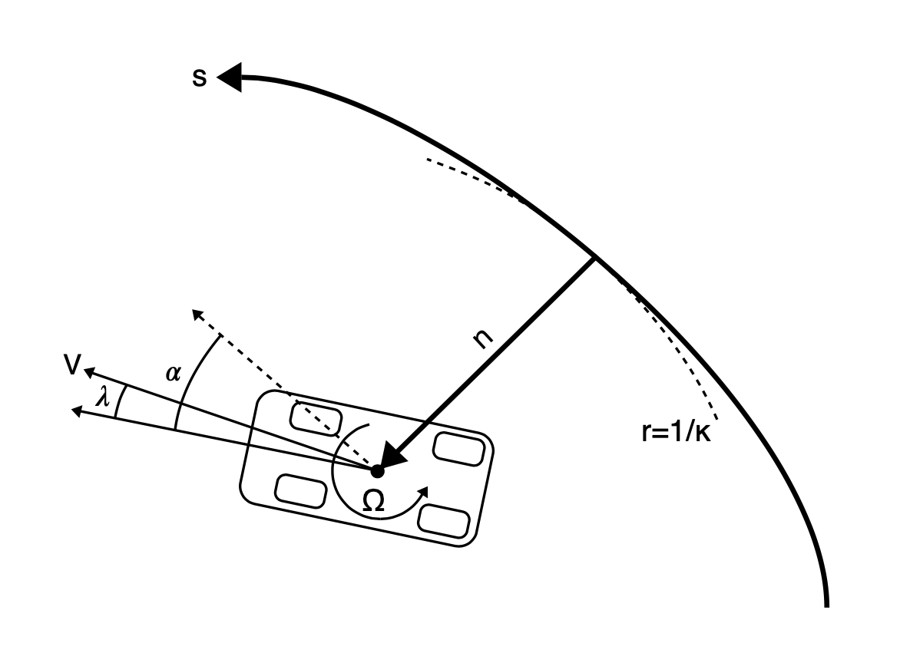

# Race car Lap Simulation

!!! info "Things you'll learn through this example"
    - Optimizing trajectories for cyclic events (such as race car laps)
        - Linking a phase with itself so it is ensured that start and end states are identical
    - Using an independent variable other than time

!!! note "The race track problem"
    _The race track problem is different from other dymos example problems in that it is a cyclic problem. 
    The solution must be such that the start and end states are identical. The problem for this example 
    is given a race track shape, what is the optimum values for the controls such that the time elapsed to complete
    the track is a minimum._

## Background of the problem

This example is based on the work of [Pieter de Buck](http://www.formulae.one/contact)
The goal of his problem was to find an optimal trajectory for the race car with active aerodynamic and 
four wheel drive controls.

Pieter posted an [issue](https://github.com/OpenMDAO/dymos/issues/369) to the Dymos repository asking
how to use dymos for cyclic events such as this. His solution involved using an iterative solution, which worked but
dymos includes a feature that allows for simple and more efficient solution. 
This example shows how to handle this situation using simple dymos calls without iteration.

If you are interested, Pieter and Adeline Shin have created an 
[interactive visualization](http://www.formulae.one/lapsimulation) using his version of the code.

While Pieter's code includes several actual race tracks shapes, for simplicity and speed of solution, this dymos
example uses an oval track. If you
are interested in trying other race tracks, they are defined in the
[tracks.py](https://github.com/OpenMDAO/dymos/tree/master/dymos/examples/racecar/tracks.py) file. 

It is easy to use a different track. For example, in the 
[test_doc_racecar.py](https://github.com/OpenMDAO/dymos/examples/racecar/doc/test_doc_racecar.py)
file, 

modify the lines:

```python
from dymos.examples.racecar.tracks import ovaltrack
track = ovaltrack
```

For example, to use the Monaco track, 

```python
from dymos.examples.racecar.tracks import Monaco
track = Monaco
```

## Optimizing trajectories for cyclic events

For trajectory optimization of cyclic events (such as race car laps), there needs to be
a way that ensure that the start and end states are identical.

In this race car example, the states and controls such as velocity, thrust, and steering angle need
to be the same at the start and finish. 

Linking the controls is not really needed since it generally follows from the linked states.

There is a simple way to link the states of cyclic events in dymos. 
You can use the `Trajectory.link_phases` functionality to "link" a 
phase with itself. In this example this is accomplished with the following code which links all 7 state
variables.

``` {.sourceCode .python}
traj.link_phases(phases=['phase0', 'phase0'], vars=['V','n','alpha','omega','lambda','ax','ay'], locs=('final', 'initial'))
```

This code causes the value of `V` at the end of `phase0` ('final') to be linked via constraint 
to the value of `V` at the beginning ('initial') of `phase0`. 
This call does the same for the other 6 state variables as well.

See the [Trajectory API page](https://openmdao.github.io/dymos/api/trajectory_api.html)
for more information about the `link_phases` method.

## Using an independent variable other than time

In all the other dymos examples, time is the independent variable. 
In this race car example, the independent variable is the arc length along the track.  
Integration is done from the start of the track to the end.
The “typical” equations of motion are computed, so the rate of change of x wrt time (**$\frac{dx}{dt}$**).

By dividing the rates of change w.r.t. time by (**$\frac{ds}{dt}$**), 
the rates of change of the states w.r.t. track arclength traversed are computed.

## Definition of the problem

Here are some figures which help define the problem. 

This table describes the controls, states, and constraints. The symbols match up with the
variable names in the code shown at the bottom of this page. 

###### Table 1. Optimization problem formulation

|                     |                               | Symbol    | Lower | Upper | Units      |
|---------------------|-------------------------------|-----------|-------|-------|------------|
| **Minimize**        | Time                          |         t |       |       |          s |
| **With respect to** |                               |           |       |       |            |
| **Controls**        | Front left thrust             | $T_{fl}$  |       |       |            |
|                     | Front right thrust            | $T_{fr}$  |       |       |            |
|                     | Rear left thrust              | $T_{rl}$  |       |       |            |
|                     | Rear right thrust             | $T_{rr}$  |       |       |            |
|                     | Rear wing flap angle          | $\gamma$  |     0 |    50 |        deg |
|                     | Steering angle                |  $\delta$ |       |       |        rad |
| **States**          | Speed                         |         V |       |       |  $ms^{-1}$ |
|                     | Longitudinal acceleration     |     $a_x$ |       |       | $ms^{-2}$  |
|                     | Lateral acceleration          |     $a_y$ |       |       | $ms^{-2}$  |
|                     | Normal distance to centerline |         n |    -4 |     4 |          m |
|                     | Angle relative to centerline  |  $\alpha$ |       |       |        rad |
|                     | Slip angle                    | $\lambda$ |       |       |        rad |
|                     | Yaw rate                      | $\Omega$  |       |       | $rad^{-1}$ |
| **Subject to**      | Front left adherence          | $c_{fl}$  |     0 |     1 |            |
|                     | Front right adherence         | $c_{fr}$  |     0 |     1 |            |
|                     | Rear left adherence           | $c_{rl}$  |     0 |     1 |            |
|                     | Rear right adherence          | $c_{rr}$  |     0 |     1 |            |
|                     | Front left power              | $P_{fl}$  |       |    75 |         kW |
|                     | Front right power             | $P_{fr}$  |       |    75 |         kW |
|                     | Rear left power               | $P_{rl}$  |       |    75 |         kW |
|                     | Rear right power              | $P_{rr}$  |       |    75 |         kW |
|                     | Periodic state constraints    |           |       |       |            |
|                     | System dynamics               |           |       |       |            |
|                     | Track Layout                  |           |       |       |            |

The next figure defines the vehicle parameters. Again, the symbols match up with the
variable names in the code.

###### Table 2. Vehicle parameters

| Parameter      | Value                                | Units       | Description                                |
|----------------|--------------------------------------|-------------|--------------------------------------------|
| $M$            | 1184                                 | $kg$        | Vehicle mass                               |
| $a$            | 1.404                                | $m$         | CoG to front axle distance                 |
| $b$            | 1.356                                | $m$         | CoG to rear axle distance                  |
| $t_w$          | 0.807                                | $m$         | Half track width                           |
| $h$            | 0.4                                  | $m$         | CoG height                                 |
| $I_z$          | 1775                                 | $kg\ m^{2}$  | Yaw inertia                                |
| $\beta$        | 0.62                                 | -           | Brake balance                              |
| $\chi$         | 0.5                                  | -           | Roll stiffness                             |
| $\rho$         | 1.2                                  | $kg\ m^{-3}$ | Air density                                |
| $\mu_{0}^{x}$  | 1.68                                 | -           | Longitudinal base friction coefficient     |
| $\mu_{0}^{y}$  | 1.68                                 | -           | Lateral base friction coefficient          |
| $K_{\mu}$      | -0.5                                 | -           | Tire load sensitivity                      |
| $K_{\lambda}$  | 44                                   | -           | Tire lateral stiffness                     |
| $\tau_{a_{x}}$ | 0.2                                  | $s$         | Longitudinal load transfer time constant   |
| $\tau_{a_{y}}$ | 0.2                                  | $s$         | Lateral load transfer time constant        |
| $S_{w}$        | 0.8                                  | $m^{2}$     | Wing planform area                         |
| $CoP$          | 1.404                                | $m$         | Center of pressure to front axle distance  |

There is also a figure which describes the states that govern the vehicle position 
relative to the track.



Here is the code to solve this problem:

{{ embed_test('dymos.examples.racecar.doc.test_doc_racecar.TestRaceCarForDocs.test_racecar_for_docs') }}

