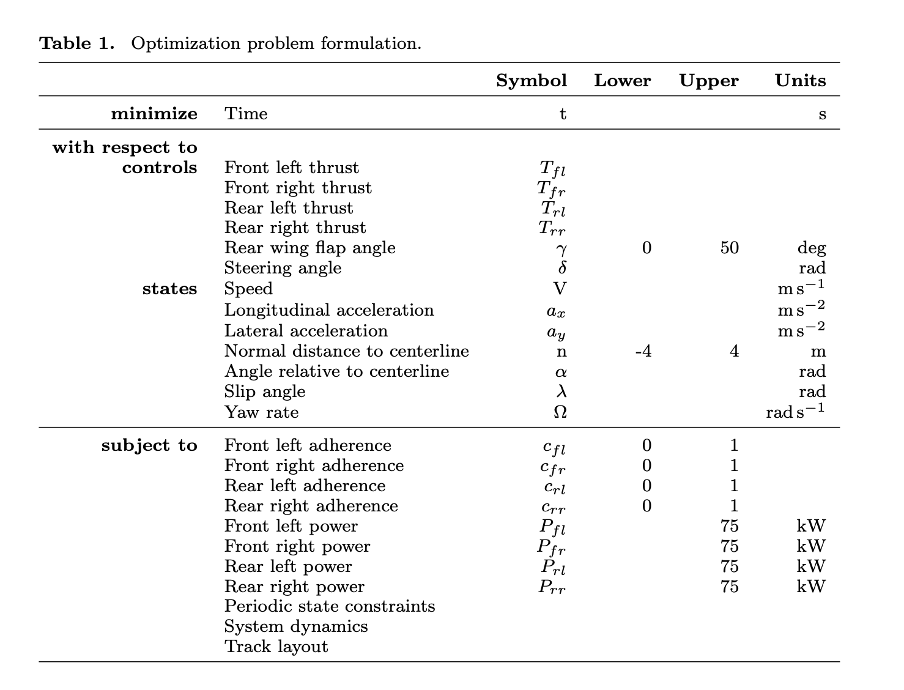
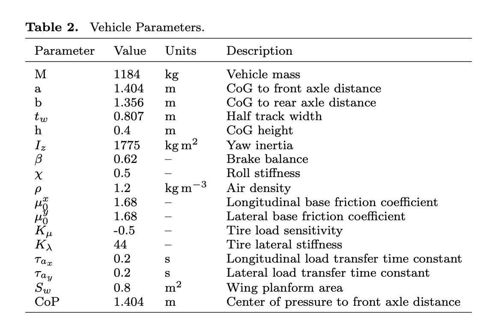

# Racecar Lap Simulation

!!! info "Things you'll learn through this example"
    - Optimizing trajectories for cyclic events (such as racecar laps)
        - Linking a phase with itself so it is ensured that start and end states are identical
    - Using an independent variable other than time

!!! note "The racetrack problem"
    _The racetrack problem is different from other dymos example problems given in that it is a cyclic problem. 
    The solution must be such that the start and end states are identical. The problem for this example 
    is given a racetrack shape, what is the optimum values for the controls such that the time elapsed to complete
    the track is a minimum._

## Background of the problem

This example is based on the work of [Pieter de Buck](http://www.formulae.one/contact)
The goal of his problem was to find an optimal trajectory for the race car with active aerodynamic and 
four wheel drive controls.

Pieter posted an [issue](https://github.com/OpenMDAO/dymos/issues/369) to the Dymos repository asking
how to handle using dymos for cyclic events. His solution involved using an iterative solution, which was less than
ideal. This example shows how to handle this situation using simple dymos calls without iteration.

If you are interested, Pieter and Adeline Shin have created an 
[interactive visualization](http://www.formulae.one/lapsimulation) using his version of the code.

While Pieter's code includes several actual racetracks shapes, for simplicity, this dymos
example uses an oval track. If you
are interested in trying other racetracks, they are defined in the
[tracks.py](https://github.com/OpenMDAO/dymos/tree/master/dymos/examples/racecar/tracks.py) file. To change
the track, modify the line in the main `problem_solver.py` file.

``` {.sourceCode .python}
track = tracks.ovaltrack
```
to use another track,for example, to use the Monaco track, 

``` {.sourceCode .python}
track = tracks.Monaco
```

## Optimizing trajectories for cyclic events

For trajectory optimization of cyclic events (such as race car laps), it would be helpful 
to be able to define constraints that ensure that the start and end states are identical.

For a cyclic event like a race-car going around a lap 
we need the states and controls such as velocity, thrust, and steering angle to be the same at the 
start and finish. 

There is a simple way to accomplish this in dymos. You can use the `Trajectory.link_phases` functionality to "link" a 
phase with itself. In this example this is accomplished with the following code which links all 7 state
variables.

``` {.sourceCode .python}
traj.link_phases(phases=['phase0', 'phase0'], vars=['V','n','alpha','omega','lambda','ax','ay'], locs=('++', '--'))
```

Then the value of `V` at the end of `phase0` ('++') is linked via constraint to the value of `V` at the 
beginning ('--') of `phase0`. This call does the same for the other 6 state variables as well.

Linking the controls is not really needed since it generally follows from the linked states.

See the [Trajectory API page](https://openmdao.github.io/dymos/api/trajectory_api.html)
for more information about the `link_phases` method.

## Using an independent variable other than time

In all the other dymos examples time is the independent variable. 
In this example, the independent variable is the arc length along the track.  
Integration is done from the start of the track to the end.
The “typical” equations of motion are computed, so rate of change of x wrt time (dx/dt).
But then also computed is the rate in change of arc length wrt time (ds/dt).

## Definition of the problem

Here are some figures which help define the problem. 

This table describes the controls, states, and constraints. The symbols match up with the
variable names in the code. 



The next figure defines the vehicle parameters. Again the symbols match up with the
variable names in the code.



There is also a figure which describes the states that govern the vehicle position 
relative to the track.


If I want an example with script/output/plots, need to do something like this

{{ embed_test('dymos.examples.brachistochrone.doc.test_doc_brachistochrone_upstream_control.TestBrachistochroneUpstreamControl.test_brachistochrone_upstream_control') }}

