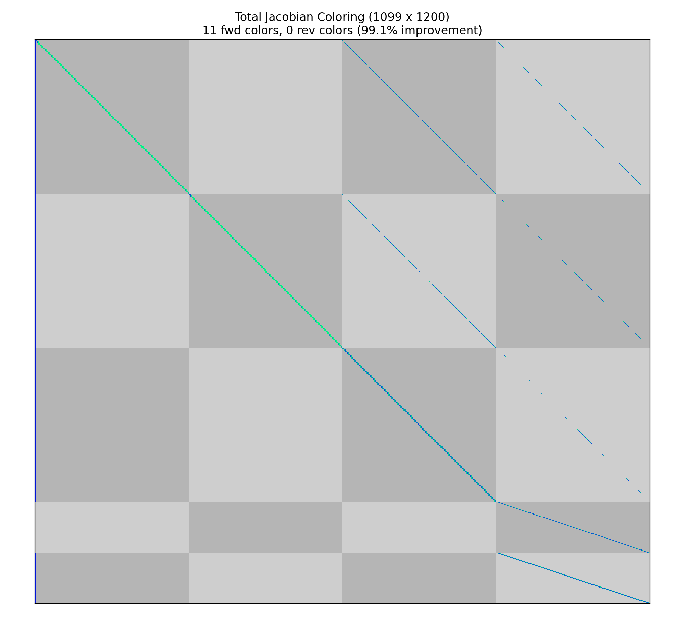

# Exploiting Sparsity for Faster Derivative Calculation

A key feature of collocation algorithms such as high-order Gauss-Lobatto collocation or the Radau pseudospectral method is that they exhibit a large degree of *sparsity* in the total Jacobian.
By modeling the state-time histories as a series of polynomial segments, the collocation defect constraints within each segment are largely dependent only on the state and control values within the same segment.
Pseudospectral optimization tools such as SOCS, OTIS, and GPOPS-II have long used the notion of *sparse finite differences* to perturb multiple independent variables simultaneously when approximating the constraint Jacobian.
This can significantly reduce the computational effort required to approximate the entire Jacobian via finite difference.

The unique way in which OpenMDAO assembles analytic derivatives across the problem allows us to use a similar approach to provide the analytic constraint Jacobian.
This approach can reduce the time required to solve moderately-sized optimal control problems by orders of magnitude and make the convergence more robust.

OpenMDAO uses a [simultaneous "coloring" algorithm](http://openmdao.org/twodocs/versions/latest/features/core_features/working_with_derivatives/simul_derivs.html) to determine which variables can be perturbed simultaneously to determine the total constraint Jacobian.
Variables in the same "color" each impact a unique constraint, such that when all the variables are perturbed we can be assured that any change in the constraint vector is due to at most one scalar variable.
Since OpenMDAO uses a linear solver to assemble to total derivative Jacobian, coloring reduces the number of linear solves from one per variable in forward mode to one per *color*.
In the brachistochrone example below this reduces the number of linear solves from 1001 to 9.
This capability makes problems of moderate size run orders of magnitude faster, and can make intractably large problems tractable.

!!! note
    While some optimizers (SNOPT and IPOPT) are particularly adept at dealing with large, sparse nonlinear programming problems, coloring can still benefit drivers which do not account for sparsity (such as SLSQP) since it significantly reduces the cost of computing the Jacobian.

## Step 1: Using OpenMDAO's Simul-Coloring Capability

OpenMDAO supports dynamic simul-coloring, meaning it can automatically run the Jacobian coloring algorithm before handing the problem to the optimizer.
To enable this capability, simply add the following line to the driver.

``` python
driver.declare_coloring()
```

By default the coloring algorithm will attempt to determine the sparsity pattern of the total jacobian
by filling the partial jacobian matrices with random noise and searching for nonzeros in the resulting
total jacobian.  At times this might report that it failed to converge on a number of nonzero entries.
This is due to the introduction of noise during the matrix inversion by the system's linear solver.
This can be remedied by using a different linear solver, such as PETScKrylov, or by telling the
coloring algorithm to accept a given tolerance on the nonzero elements rather than trying to determine
it automatically.  This can be accomplished with the following options to declare coloring:

``` python
driver.declare_coloring(tol=1.0E-12, orders=None)
```

Setting `orders` to None prevents the automatic tolerance detection.
The value of `tol` is up to the user.
If it is too large, then some nonzero values will erroneously be determined to be zeros and the total derivative will be incorrect.
If `tol` is too small then the sparsity pattern may be overly conservative and degrade performance somewhat.
We recommend letting the coloring algorithm detect the sparsity automatically and only resorting to a fixed tolerance if necessary.

## Running the coloring algorithm separately

OpenMDAO supports the ability to run the coloring algorithm "offline" and then provide the data to the driver via a saved file.
This is potentially useful to users whose model is particularly expensive to color, and whom aren't changing the problem structure between runs.

!!! note

    Adding or removing constraints, controls, states, or parameters, as well as changing the objective variable or changing the grid will all affect the fundamental size of the optimizaiton problem and therefore will require a new coloring.
    Simply changing constraint bounds or scaling on variables and constraints will not fundamentally change the size of the problem and will therefore not require a recoloring.

The `use_static_coloring` Driver method in OpenMDAO is documented [here](http://openmdao.org/twodocs/versions/latest/features/core_features/working_with_derivatives/simul_derivs.html#static-coloring).

## Viewing the sparsity

The summary of the sparsity pattern can be obtained following a run with the [OpenMDAO command line view_coloring utility](http://openmdao.org/twodocs/versions/latest/other/om_command.html).

``` bash
openmdao view_coloring coloring_files/total_coloring.pkl 
```
where the `coloring_files/total_coloring.pkl` file is automatically generated in the run directory by OpenMDAO when coloring is used.
For this example, the [Brachistochrone example](../examples/brachistochrone/brachistochrone.md) is used with 100 3rd-order segments in the Radau transcription.
The output is:

```
Jacobian shape: (1099, 1200)  ( 0.54% nonzero)
FWD solves: 11   REV solves: 0
Total colors vs. total size: 11 vs 1200  (99.1% improvement)

Sparsity computed using tolerance: 1e-08
Time to compute sparsity: 1.706023 sec.
Time to compute coloring: 0.038774 sec.
```

In addition, adding the `--view` flag to the command will generate a visualization of the sparsity using matplotlib.

The gray checkerboard represents the vectorized variables (columns) and constraints (rows).
In this case, the column groupings correspond `t_duration`, followed by the states `x`, `y`, and `v`, and finally the control `theta`.
The rows groupings correspond to the state defects on `x`, `y`, and `v`, followed by the `theta` control value continuity constraints and the `theta` control rate continuity constraints.
The ordering of these variables and constraints is the same as output by the pyOptSparseDriver.

In this case we can see that there is a single dense column on the left.
This is the phase duration, which impacts all of the defect constraints in the problem.



## Performance comparison with and without simultaneous derivatives

In comparison, the 100-segment, Radau-based brachistochrone problem _without_ coloring solves in roughly two minutes with a 2.4 GHz Intel Core i9 processor using the IPOPT optimizer.
While computing the sensitivity itself takes only 16 seconds, the large amount of data being used to store knowably-zero quantities is quite large, which results in a lot of time spent in the optimizer dealing with that data.

|                                | With Dynamic Coloring | Without Coloring |
|--------------------------------|-----------------------|------------------|
| Total Time                     | 1.5692                | 127.9437         |
| User Objective Time            | 0.0510                | 0.0957           |
| User Sensitivity Time          | 0.6618                | 16.5347          |
| Interface Time                 | 0.5668                | 2.1390           |
| Opt Solver Time                | 0.2896                | 109.1743         |
| Calls to Objective Function    | 24                    | 28               |
| Calls to Sens Function         | 24                    | 28               |
