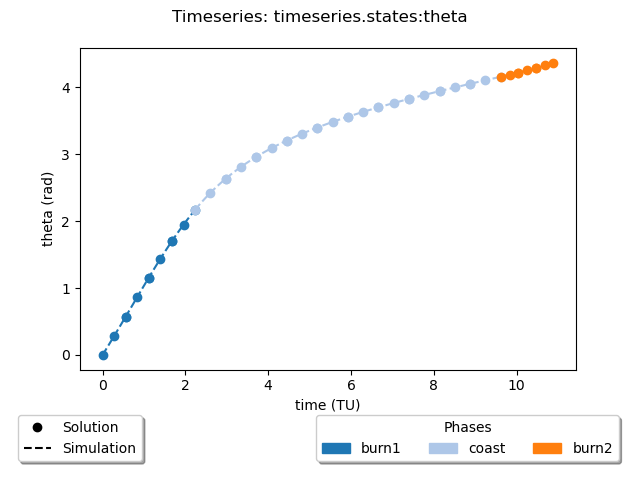

# Plotting Timeseries

Dymos provides a simple function to plot timeseries,

`timeseries_plots(solution_recorder_filename, simulation_record_file=None, plot_dir="plots")`

A separate plot file will be created for each timeseries variable. The plots will be saved and not 
displayed. The user has to manually open the plot files for them to be displayed.

The only required argument, `solution_recorder_filename`, is file path to the case recorder file 
containing the solution results.

If the optional argument, `simulation_record_file`, is given, then that will be used to get data for
plotting the timeseries of the simulation. 

Finally, the optional argument, `plot_dir`, can be set to indicate where the plot files will be saved.

Here is an example of the kind of plot that is created.

