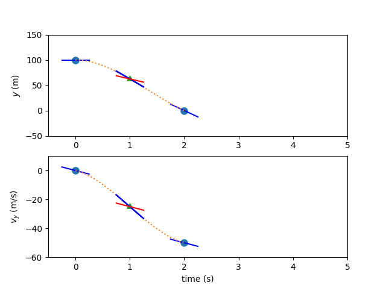
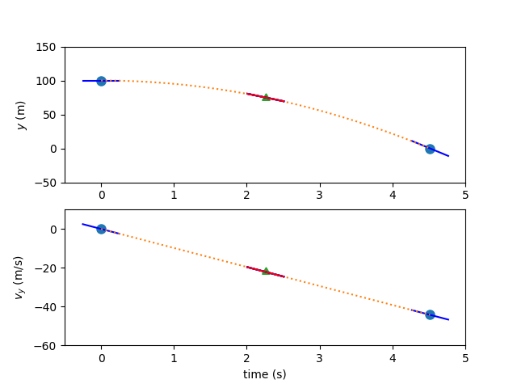

# What is collocation?

Dymos is focused on direct optimization methods based on an implicit integration technique, collocation.

The _state_ of a dynamic system defines its configuration at a point in time.
Common state variables for dynamic systems are position, velocity, and mass.
Given an initial state, a time duration, and ordinary differential equations that define the evolution of the states in time, the state of the system at the end of the time duration can be determined.
This is known as the _initial value problem_ (IVP) and there are numerous techniques and software packages that can be used to solve the IVP.
The initial value problem is typically the basis for the simulation of systems.
This time-marching approach is the basis for _shooting methods_ in optimization.
While Dymos supports shooting methods, its focus is on implicit collocation techniques, for performance reasons.

First, a few assumptions about the dynamic system:

1.  Over portions of the trajectory, the state is continuous (there are no instantaneous changes in the states)
2.  Over portions of the trajectory, the state is continuous in its first derivative w.r.t. time. (there are no instantaneous changes in the state rates)

If those two conditions are met, then it's reasonable to fit a polynomial to a plot of the state value over time.
Given the initial or final value of a state, and values of its rate at some number of points across the trajectory, then a polynomial can be fit whose initial or final value matches, and whose rates match the sampled rates.
The value of the state at any point throughout the trajectory can then be inferred by interpolating the collocated polynomial.

Solving this trajectory implicitly basically means _guessing_ values for the states along the trajectory.
While one could use a power series polynomial coefficients ($a t^2 + b t + c$), these coefficients can have vastly different values depending on the shape of the curve, making them difficult to scale numerically.
Instead, Lagrange interpolating polynomials are typically used, where the actual values to be interpolated at various points are the implicit variables.
This makes scaling the problem easier, and gives the implicit variables more intuitive meaning, making it easier to provide an initial guess.

## Example:  Simulating the fall of an object

As a "hello, world" problem for Dymos, consider the vertical fall of an object acting under gravity - like Galileo dropping cannonballs from the Tower of Pisa.
Ignoring aerodynamics and treating the ball as a point mass in a rectilinear gravity field, the motion is governed by:

\begin{align}
    \ddot{y} = -g
\end{align}

The techniques in Dymos are generally centered around first-order dynamics, so we convert the above equation into the following system of ODEs.

\begin{align}
    \dot{y} &= v_y \\
    \dot{v_y} &= -g
\end{align}

One common way to propagate this trajectory would be to use an "explicit time-marching" approach.
That is, we can use Euler's method or a Runge-Kutta approach to propagate the trajectory of the ball, one small slice of time at a time.
When performing trajectory optimization, the trajectory is typically evaluated at least dozens of time.
If the ODE for the system is computationally expensive, this time-marching approach can take a very long time.

Instead, we can use an implicit simulation technique to more efficiently model the trajectory.
First, let's assume that the value of the _states_ $y$ and $v_y$ smoothly vary in time (there's no teleportation or instantaneous changes in velocity).
Now we can fit a polynomial to the plot of each of these states with respect to time.
In this case, basic physics tells us that $v_y$ should be linear with time and $y$ should be quadratic with time.

Now for the simulation, lets solve a _boundary value problem_.
We know the initial and final height of the ball.
We know the initial velocity but not the terminal velocity.

_How long does it take the ball to reach the ground from an initial height of 100 m?_

We will explain how this problem is solved using the two implicit simulation techniques in Dymos:  high-order Gauss-Lobatto collocation, and the Radau Pseudospectral Method.

## Finding the trajectory using high-order Legendre-Gauss-Lobatto collocation

Using a 3rd-order polynomial segment to mimic the trajectory, we have two states and thus two polynomials.
Legendre-Gauss-Lobatto (LGL) collocation uses knowledge of the states and state-rates to form an interpolating polynomials.
A third-order polynomial requires four pieces of information to define it.
We'll take two points along the trajectory, and use those to guess the state values.
In Dymos, these points where state values are provided are called the _state discretization nodes_.
In LGL collocation, these points are chosen to be the LGL _nodes_ in the dimensionless time of the segment, which we call $\tau_s$.

Our initial guess for the trajectory might look something like this:

| Variables  | Description       | Value          | Notes                  |
|------------|-------------------|----------------|------------------------|
| $y_0$      | initial height    | 100 m          | fixed                  |
| $y_f$      | final height      | 0 m            | fixed                  |
| $v_{y0}$   | initial velocity  | 0 m/s          | fixed                  |
| $v_{yf}$   | final velocity    | -50 m/s        | free                   |
| $t_0$      | initial time      | 0              | fixed                  |
| $t_d$      | time duration     | 5              | free                   |
| $g$        | grav. acceleration| 9.80665 m/s^2  | assumed                |

To form 3rd-order polynomials for the states we need four pieces of information, but so far we only have the two endpoint values.
We'll use the state rates at the state discretization nodes to provide the other two values needed for interpolation.
To obtain these, we evaluate our ODE at the state discretization nodes.

\begin{align}
    \dot{y}_0 &= 0 \\
    \dot{y}_f &= -50 \\
    \dot{v}_{y0} &= -9.80665 \\
    \dot{v}_{yf} &= -9.80665
\end{align}

But how do we know that our assumed trajectory is correct?
In LGL collocation, we check the interpolated slope of the polynomial at a 3rd point (the collocation node) and compare it to an evaluation of the ODE at the same point.
If the difference between the two is sufficiently close to zero, we can be somewhat confident that our polynomial is a reasonable match for the true time-history.
We call this difference in slope the collocation _defect_.

Having computed the ODE at the state discretization nodes, we can form interpolants for the values and the slope of the states at the collocation nodes.
Dymos uses Lagrange interpolants, such that the inputs to the system are the values of the states and controls, rather than less intuitive coefficients.
In this case, the state values at our single collocation node are:

\begin{align}
    y_m &= 50 \\
    v_{ym} &= -25
\end{align}

The polynomial slopes at the collocation node are:

\begin{align}
    y'_m &= 50 \\
    v'_{ym} &= -25
\end{align}

Now, having the state and time values at the collocation nodes, we can again evaluate the ODE.

\begin{align}
    \dot{y}_m &= -17 \\
    \dot{v}_{ym} &= -9.80665
\end{align}

In this case the known variables are the value of the polynomial at the left endpoint ($y_0$), and the value of the independent variable at the left and right endpoints of the interval to be fitted ($x_0$, $x_1$)
In this case, there are no _control_ inputs to the ODE.
However, if there were, the value of the control would also need to be provided at the collocation node.
Thus, in high-order Gauss-Lobatto collocation, the _control input nodes_ include both the state discretization nodes and the collocation nodes.

The free variables in the problem ($t_{duration}$ and $v_{yf}$) can be iterated until the difference between the interpolated state rates and the ODE-computed state rates is zero.

## Finding the trajectory using the Radau Pseudospectral Method

Again, there are two states, and two corresponding 3rd-order polynomials representing the time history.
As with the Gauss-Lobatto method, a third-order polynomial requires four pieces of information to define it.
In the case of the Radau Pseudospectral Method, we'll use four state values, guessed at the Radau nodes in dimensionless time in addition to the right endpoint of the interval (the _state discretization nodes_).

A linear interpolation of the endpoint values will serve as the initial guess in this instance.
The three Radau nodes that don't include the right endpoint will serve as the _collocation nodes_ in this case.
Since these are a subset of the state discretization nodes, no interpolation of values is necessary...all of the state values have been provided.

The derivative of the interpolating polynomial is computed using a differentiation matrix and the state discretization values.

Now the ODE can be evaluated to calculate the state rates, and the results compared to the interpolated slopes.

Again, the free variables are iterated until the defects are zero and any boundary conditions are met.

## Multiple Segments

The simple examples above use one single 3rd-order polynomial to represent the time history of the states.
With more complex states, a single 3rd-order polynomial would not be capable of replicating the time history.
In practice, we can use more polynomial segments _and_ higher-order polynomials to better match the dynamics.

In the case of adding more segments, one can choose whether the segment boundaries are shared by the segments, or independent.
If they are shared, fewer design variables are necessary, but it may be more difficult for the optimizer to search for a solution.
This is called "compressed" transcription.
On the other hand, we can doubly-specify state values at segment boundaries as design variables, thus increasing the size of the problem.
In this "uncompressed" formulation, continuity constraints are imposed at the segment bounds to ensure that there are no discontinuities in the state time-history at segment bounds.

## LGL vs LGR Collocation

Gauss-Lobatto collocation results in smaller NLP sizes for the optimizer since fewer states are treated as design variables.
The cost of this reduction is the interpolation step in the Gauss-Lobatto algorithm.
While the Radau Pseudospectral method requires one evaluation of the ODE to assess the defects, the Gauss-Lobatto method requires two.
In addition, the interpolation step used by the Gauss-Lobatto method can result in interpolated state values falling well outside the user's expected range if the initial guess is not sufficiently accurate.
This can cause convergence issues if there are nonlinear solvers within the ODE that rely on a reasonable guess to achieve convergence.

## Satisfying Defects with a Nonlinear Solver

Typically, collocation problems are solved by posing the defects as constraints to an optimizer.
In Dymos, another option exists.
One can use an embedded Newton-solver to satisfy the defect and continuity constraints.
This mode, which we call `solve_segments`, gives the Newton-Solver control over all but the first or final state value in the phase.
The optimizer only controls the initial or final value, and the solver is responsible for converging the trajectory time history.
This results in a shooting method, but one that is mathematically consistent with the collocation methods.
This `solve_segments` capability is useful if a user simply wants to propagate a dynamic system and not optimize it.