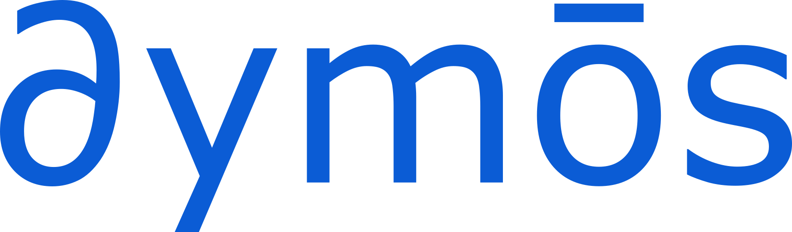

# Multidisciplinary Optimal Control Library

The goal of Dymos is to enable the optimization of subsystem designs which are tightly connected with each other as well as the operation of the overall system.

Dymos is a library for the optimal control of dynamic multidisciplinary systems.
While it can optimize typical optimal control problems, its key feature is the ability to optimize _systems_ in which a trajectory is just one part of the overall optimization.
Other optimization software frequently relies on the parameterization of the hardware models to, for instance, approximate the mass of an engine as a function of its thrust level.
Instead, Dymos allows you to impose higher-fidelity design considerations on these subsystems - from simple parameterized models to high-fidelity CFD models, and apply the resulting subsystem designs to the trajectory profile.

To do this, Dymos relies on ability of OpenMDAO to compute accurate derivatives very efficiently.
This capability enables users of Dymos to embed iterative procedures within their system dynamics.
While normally this would significantly impair performance, Dymos can optimize such systems with minimal performance degradation, freeing the user from reformulating their design specifically for the purposes of the optimal control implementation.

## Key Features

- Employ Gauss-Lobatto collocation[@herman1996direct] or the Radau Pseudospectral method[@garg2011direct] to find optimal control for a dynamic system.
- Find the optimal design of a system that can satisfy a variety of different trajectories.
- Embed nonlinear solvers within the system dynamics.
  - Transform typical state variables into control variables (differential inclusion [@Seywald1994]).
- Use nonlinear solvers to satisfy the collocation constraints.
  - Single and multiple shooting within the same interface.
- Leverage multiprocessing capabilities to improve performance

## Installation

The cutting-edge development version of Dymos may be installed with

~~~bash
python -m pip install git+https://github.com/OpenMDAO/dymos.git
~~~

To specify a release, add it after an @ at the end of the URL.

~~~bash
python -m pip install git+https://github.com/OpenMDAO/dymos.git@0.15.0
~~~

If you intend to hack on the internals of Dymos, it is recommeneded that
you install it in developer mode.  This removes the need to reinstall
Dymos after changes are made.

In terminal, clone the repository using git.

Go into the Dymos directory and use the command pip install -e . to install dymos.

~~~bash
git clone https://github.com/OpenMDAO/dymos.git ./dymos.git
python -m pip install -e dymos.git
~~~

## Citation

If you utilize Dymos in your work, please reference it using the following citation.

~~~
@inbook{falck2019,
author = {Robert D. Falck and Justin S. Gray},
title = {Optimal Control within the Context of Multidisciplinary Design, Analysis, and Optimization},
booktitle = {AIAA Scitech 2019 Forum},
chapter = {},
pages = {},
doi = {10.2514/6.2019-0976},
URL = {https://arc.aiaa.org/doi/abs/10.2514/6.2019-0976},
eprint = {https://arc.aiaa.org/doi/pdf/10.2514/6.2019-0976}
}
~~~

## References

\bibliography
